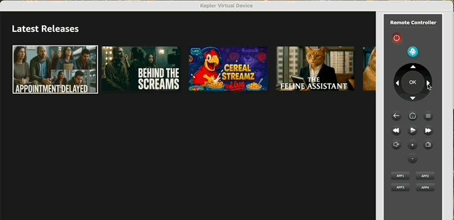
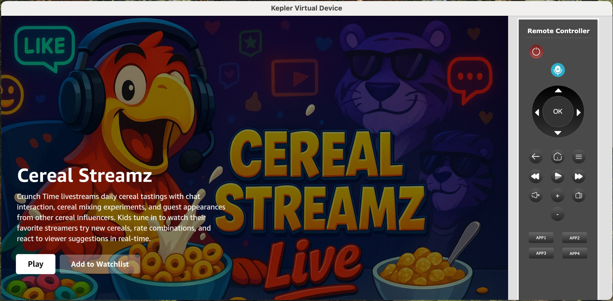

# Phase 3: Create a 3 Screen App

Now the fun part! We are going to build our TV-based UI, a basic 3-screen video streaming app with some AI-generated videos.

*If you do not wish to use AI (or were unable to use AI), you can always follow our tutorial on our tech docs: <https://developer.amazon.com/docs/vega-tutorial/0.21/introduction.html>*

## 3.1: Add a Home Screen

First we are going create a home screen component that will replace the main screen from the hello world app. This home screen will contains a grid of movie titles (that we will retrieve via a network API call) and eventually allow the user to play back one of these titles. We are going to use AI Prompts (with our Vega MCP server) to assist us in developing.

**Important: AI is literally different every time and can make mistakes. It is important that you ensure each step is working BEFORE you proceed to the next step because it gets progressively harder to debug the farther you get (IE if your app is crashing, do not proceed until you resolve the error). We also highly recommend you inspect each code diff as you go along and also "git commit" after each step so you have an easy way to roll back any broken code. Raise your hand or flag us down if you get stuck at any point.**

**Add a home screen component, Prompt:**

```
For this Vega app, I want to create a new component called HomeScreen with just some placeholder text of "Home Screen". And I want to replace the content of App.tsx with HomeScreen and it should take up the entire screen.
```

Assuming you have Fast Refresh enabled, your app UI should automatically update to something like the following:


You should have a new HomeScreen.tsx (likely in a new "screens" folder) with content similar to this:

```javascript
import React from 'react';
import {View, Text, StyleSheet} from 'react-native';

export const HomeScreen = () => {
  return (
    <View style={styles.container}>
      <Text style={styles.text}>Home Screen</Text>
    </View>
  );
};

const styles = StyleSheet.create({
  container: {
    flex: 1,
    justifyContent: 'center',
    alignItems: 'center',
    backgroundColor: '#1a1a1a',
  },
  text: {
    fontSize: 48,
    color: '#FFFFFF',
  },
});
```

It's perfectly OK if your code doesn't look exactly the same. Your App.tsx should be something similar to this:

```javascript
import React from 'react';
import {HomeScreen} from './screens/HomeScreen';

export const App = () => {
  return <HomeScreen />;
};
```

Next we are going to build the main content of our HomeScreen, which will be a row of content with some sample movie data that we will fetch from a [hosted JSON file](https://raw.githubusercontent.com/efahsl/scrap-tv-feed/refs/heads/main/catalog-fullUrls-720p.json). Take a quick look at the [file](https://raw.githubusercontent.com/efahsl/scrap-tv-feed/refs/heads/main/catalog-fullUrls-720p.json) for the data structure; notice we have a list of items with ID, title, description, images, and an mp4 video file for each. We are going to use this metadata to populate our row and eventually create a details screen and video playback screen.

We will use the following prompt, make sure you read it all. The benefit of using prompts is that we can use natural language to describe the experience we want to build, while still specifying some technical direction and details. Prompt:

```
I want to update HomeScreen to list movie content titles that the user can watch. It will contain a single row of content that we will first retrieve via a fetch call to: https://raw.githubusercontent.com/efahsl/scrap-tv-feed/refs/heads/main/catalog-fullUrls-720p.json. Check the data structure from the API. The content should be displayed as 16:9 thumbnail images in a FlatList that should be focusable via d-pad remote control and look OK when viewed far away at 10 foot.

Use the thumbnail image (not the poster image) for display, and each item should be about 400px wide (and thus 225px tall). I also want a small header above my content row called "Latest Releases". Pressing the item should result in just a console log statement for now. I'd like a white border around the actively focused element.

Let me know if you want me to clarify any questions you have before we begin (but also provide a recommendation/suggestion for any question)?
```

We like to include a question at the end of our prompt to resolve any ambiguity in our prompt; your Agent may or may not ask you some follow-up questions.

Once complete, you should have a UI that looks something like the below image:


**Optional**: modify styling. Since we are going to be using TV Directional-Pad (D-Pad) controls to drive the experience, we will need to understand what item is selected. There should be some basic indicator of what is selected, but consider modifying the style such as setting/changing a background color when focused or setting/changing the scale transform to 1.15. Try using natural language to describe any changes you'd like to make. OR go into the code of your HomeScreen.tsx and make these changes directly.

Commit changes to save your work: `git add * / git commit`

## 3.2: Add a Details Screen

Now we are going to add a second screen we can navigate to from our Home Screen. First we need to create navigation, we'll use a Stack Navigator. Then we'll create a Details Screen to confirm the content that was selected before we start playing it back.

**Add a Stack Navigator:**

```
Create a new Vega stack navigator for my project. The Home Screen should be the default (and only) route for now.
```

We should see our package.json updated with the following dependencies:

```json
"@amazon-devices/react-navigation__native": "~7.0.0",
"@amazon-devices/react-navigation__native-stack": "~7.0.0",
"@amazon-devices/react-native-screens": "~2.0.0",
```

You may need to run `npm install` to install these dependencies

Your App.tsx may look something like the following:

```javascript
const Stack = createNativeStackNavigator<RootStackParamList>();

export const App = () => {
  return (
    <NavigationContainer>
      <Stack.Navigator
        initialRouteName="Home"
        screenOptions={{
          headerShown: false,
        }}>
        <Stack.Screen name="Home" component={HomeScreen} />
      </Stack.Navigator>
    </NavigationContainer>
  );
};
```

If your app loads up properly and shows your Home Screen without errors, you may continue.

Now let's build the actual DetailsScreen, prompt (again, make sure you read and understand what we're doing):

```
Create a new DetailsScreen component. This screen will be accessed via our stack navigator when the user presses one of the content items from the Landing page. This Details Screen should use the "banner" image from the item data which takes up the entire background of the screen and display text for the title and description (make sure these are readable on top of the background image). Add the following props to the component and pass them via navigation: banner image, title, description, and video URL.
```

A lot of activity happening here. One thing to note is that in your Home Screen you should now see navigation wired up upon button press, something like the following:

```javascript
const handleItemPress = (item: MovieItem) => {
  navigation.navigate('Detail', {
    bannerImage: item.images.poster_16x9,
    title: item.title,
    description: item.description,
    videoUrl: item.sources[0]?.url || '',
  });
};
```

You should now be able to navigate to your detail screen, and press the "back" button (or "Esc" key) to go back to the home screen.



Add actions/buttons to the screen. Now let's add some buttons to the screen so we can do something - we'll add a "Play" button which will bring us to a new Video Playback Screen (to be built next) and an "Add to watchlist" button that is a placeholder and won't be built in this workshop (though you can try doing it yourself if you like!) Prompt:

```
Add "Play" and "Add to watchlist" buttons to my DetailsScreen; the button presses should log an acknowledgment message in the logs". Make sure the buttons indicate which one is focused; the "Play" button should be focused by default.
```



Commit changes for safe-measure (`git add * / git commit`)

## 3.3: Add a Media Player

OK now we're going to add a video player. Note that with Vega we are using W3C Media APIs, of which you can read up more HERE (link to be added). Our Vega media player has two options:

1. URL mode - for playing simple content like flat mp4 files
2. MSE (Media Source Extensions) - for playing "adaptive" content including live content, DRM, 4K, etc.

For this workshop, we're going to use URL mode as we're just dealing with simple flat files. But most media streaming apps will need to use MSE mode and likely a video player library like Shaka Player, Bitmovin, or others.

**Add Media Player, In your AI Agent's chat interface, run the following prompt:**

```
Add a new VideoPlayerScreen following the Vega Video Player Example. Add it to the existing navigation structure - the video URL should be passed/linked from the Detail Screen when the user presses the "Play Video" button
```

Given that we are updating app manifest entries, you will likely need to rebuild/relaunch your app.

To test your app, navigate to the details page and play the video. Note that the Vega Virtual Device at times has trouble playing mp4 videos with a "debug" build. To remedy, you can run a "release" build which should have better stability (but you can't use Fast Refresh) or run on a Fire TV Stick which is the next section.

(Commit changes)

## 3.4 Additional Enhancements

Let's make our Home Screen a little more realistic by using multiple rows and categories of content. Use the following prompt:

```
On the HomeScreen, instead of a single row of content we want to have multiple content rows based off the "category" value from the data (re-check the data by grabbing the data from the URL again). I also want a new first row of data called "Trending Now" which would be content with the "trending" value of "true".
```

Let's add a focus management improvement, prompt:

```
I want to trap focus on each row, such that when I am at the end of a row, when I press "right", the focus should NOT go down to the next row.
```

*This should import TvFocusGuideView (if it's not already included - and you may have to "npm install" again) and implement the trapFocusLeft and trapFocusRight props.*


Finally, since our videos are short, let's add some logic that once the content finishes playing, it goes back to the previous detail screen:

```
On the Video Playback Screen, when the video playback is "done", I want to go back to the previous screen automatically.
```

Your agent should import your navigation reference via a prop and add in an event listener for "ended" (same as HTML5):

```javascript
// Add event listener for when video ends
video.current.addEventListener('ended', handleVideoEnded);
...

const handleVideoEnded = () => {
  console.log('Video playback ended, navigating back');
  navigation.goBack();
};
```

---

[← Previous: Set Up MCP Server](2_set_up_mcp_server.md) | [Next: Performance Testing →](4_performance_testing.md)
