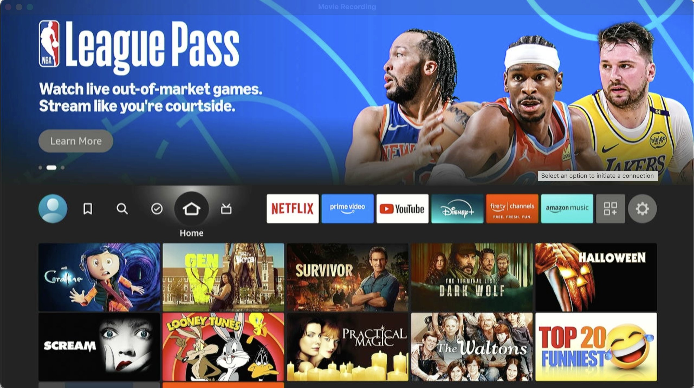
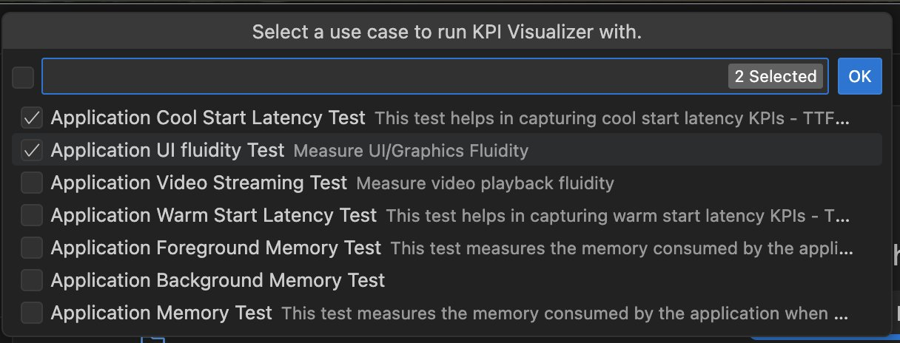

# Phase 4: Performance Testing & Analysis

Next, let's run the app on a physical FireTV stick to test the actual 10-foot experience and run some performance tests to get a performance baseline.

## 4.1: Run the App on FireTV Stick

In this milestone, let's connect the FireTV Stick to the development machine and test our app on the device

> If you have already setup and ran your app on a FireTV stick, you can skip this milestone

**Steps:**

1. Connect your FireTV stick to your development machine via the USB cable

2. If you have a HDMI Capture card, connect the HDMI port of the FireTV Stick to the capture card, then connect the capture card to your development machine

3. You should see the FireTV UI in Quicktime player on your Mac, under "New Movie Recording"

4. Complete login and registration steps on the FireTV stick using your FireTV Stick Remote

5. Run your app

   a. In Vega Studio side bar, select the FireTV Stick device under "Devices" panel and "Release" under "Build Modes", then click the play icon next to the project to build and run the app on the device

## 4.2: Performance Analysis

In this milestone, we will run a performance test on the app on a physical device to get a performance baseline.

This is required to accurately measure performance, apply targeted performance optimizations and re-measure to verify performance improvements.

**Steps:**

1. **Run Performance Performance test:**

   a. Connect a FireTV stick device and run "App KPI Visualizer" tool from Vega Studio side bar in VS Code

   i. Select following options in the wizard:

   1. KPIs: Choose - 'Cool Start Latency' and 'UI Fluidity' tests

   2. Uncheck "Record CPU Profiler" - *this option records a CPU profiler trace to deep-dive further into performance issues*

   3. Select "No" for the following:

   4. Select defaults for all other options in the wizard

   5. Once KPI Visualizer starts, you should see a notification window as below

2. **Analyze performance report**

   a. Performance report is automatically opened after performance test is completed

   b. Check which KPIs are failing

## 4.3: AI-Assisted Diagnosis

1. **Diagnose performance issues**

   a. For failing KPIs, click "Diagnose with AI" action shown in the KPI report to diagnose a failing KPI

   b. Review & apply suggested optimizations

   c. Re-run performance test

---

[← Previous: Create 3 Screen App](3_create_3_screen_app.md) | [Next: Performance Improvements →](5_performance_improvements.md)
