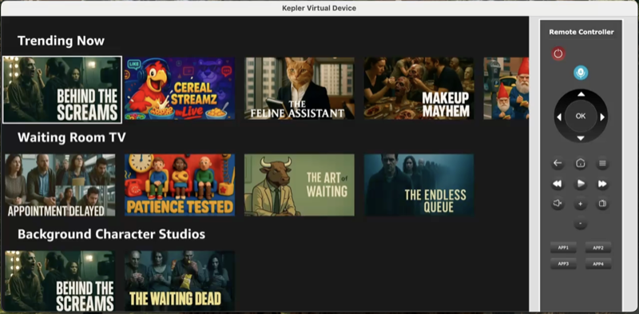
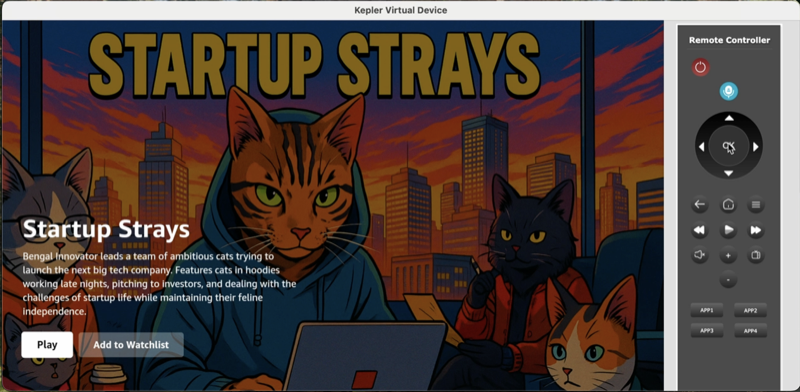
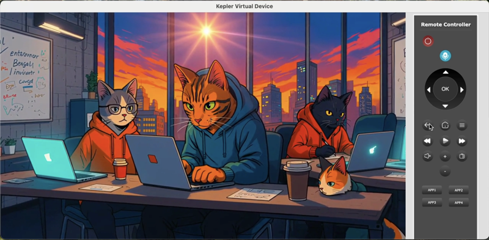

# Vega Developer Workshop for TV Apps

Welcome! This hands-on workshop will guide you through building a TV streaming app using [Amazon's Vega Developer Tools](https://developer.amazon.com/apps-and-games/vega), the Vega MCP server, and AI prompts.

## What You'll Build

You'll create a 3-screen media streaming app optimized for TV, featuring:

- A browsable content library with multiple categories
- Detailed content information screens
- Video playback capabilities
- TV-optimized navigation and focus management

## What You'll Learn

- How to develop React Native apps for TV using the Vega Developer Tools
- AI-assisted development using the Vega MCP (Model Context Protocol) server
- Performance testing and optimization techniques for TV apps
- Best practices for 10-foot UI design and D-pad navigation

## Workshop Steps

0. **[Prerequisites](workshop_steps/0_prerequisites.md)** - Install Vega SDK and development tools
1. **[Create a Hello World App](workshop_steps/1_create_hello_world_app.md)** - Set up your environment and create your first Vega app
2. **[Set Up MCP Server](workshop_steps/2_set_up_mcp_server.md)** - Configure AI-powered development assistance

**[CHECKPOINT: set up your Vega Fire TV Stick](workshop_steps/2_zCheckpoint_get_firetv_device.md)** - Validate progress and get your Fire TV Stick from us.

3. **[Create a 3 Screen App](workshop_steps/3_create_3_screen_app.md)** - Build the home screen, details screen, and video player
4. **[Performance Testing](workshop_steps/4_performance_testing.md)** - Run your app on Fire TV Stick and benchmark performance
5. **[Performance Improvements](workshop_steps/5_performance_improvements.md)** - Optimize with native Vega components
6. **[Wrap Up and Next Steps](workshop_steps/6_wrap_up_and_next_steps.md)** - Explore additional project ideas and app submission

## Getting Started

Begin with the [Prerequisites](workshop_steps/0_prerequisites.md) to ensure you have all necessary tools installed, then follow the workshop steps in order.

## Toubleshooting

Running into issues? Check out our [troubleshooting guide](https://developer.amazon.com/docs/vega/0.21/troubleshoot-overview.html) on our [Vega Developer Docs](https://developer.amazon.com/apps-and-games/vega).
