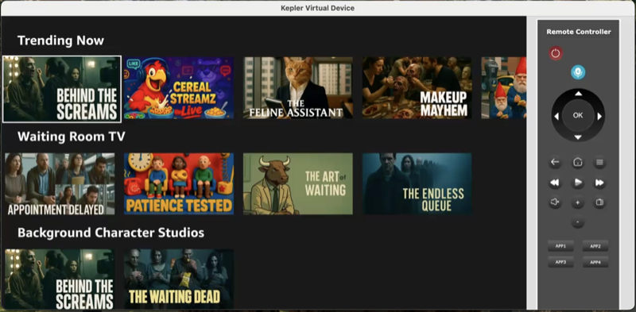
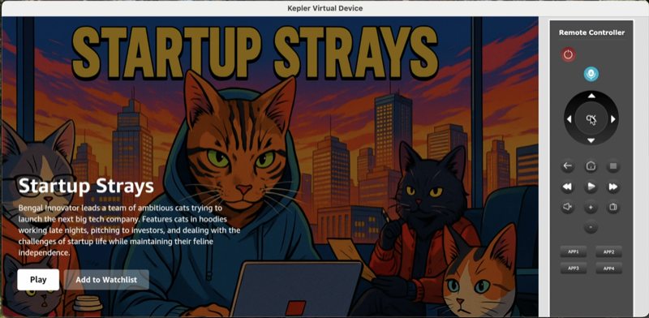
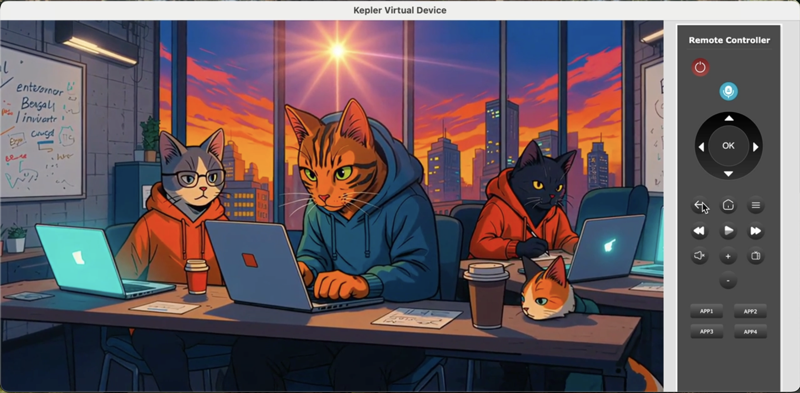

# Vega Developer Workshop for TV Apps

Welcome! This hands-on workshop walks you through using [Amazon's Vega Developer Tools](https://developer.amazon.com/apps-and-games/vega) and the `@amazon-devices/amazon-devices-buildertools-mcp` MCP server to debug and upgrade TV apps with AI assistance.

## What You'll Do

You'll clone a pre-built TV streaming reference app and use AI-powered MCP tools to:

- Debug a UI fluidity / performance issue
- Debug an app crash
- Run a Shaka media player upgrade

## What You'll Learn

- How to use the `@amazon-devices/amazon-devices-buildertools-mcp` MCP server with AI coding assistants
- Performance debugging techniques for TV apps using MCP prompts
- Crash debugging workflows with AI assistance
- Media player upgrade workflows via MCP

## Prerequisites

Check out our [Prerequisites](workshop_steps/0_prerequisites.md) page to install the Vega SDK (from the private preview npm registry) and configure your AI coding assistant. You will need a Vega Fire TV Stick with [Developer Mode](https://developer.amazon.com/docs/vega/0.22/developer-mode.html) enabled to run the workshop exercises.

## Workshop Steps

> Each exercise uses a separate branch in the [VegaWorkshopApp](https://github.com/efahsl/VegaWorkshopApp) repository. You'll switch branches between exercises.

0. **[Prerequisites](workshop_steps/0_prerequisites.md)** - Install Vega SDK and configure your environment
1. **[Clone and Run Reference App](workshop_steps/1_clone_and_run_reference_app.md)** - Clone the workshop app and verify it runs
2. **[Set Up MCP Server](workshop_steps/2_set_up_mcp_server.md)** - Install and configure the Amazon Devices Builder Tools MCP
3. **[Performance Debugging](workshop_steps/diagnose_ui_fluidity.md)** - Checkout the `perf-demo` branch and debug UI fluidity via MCP
4. **[Crash Debugging](workshop_steps/diagnose_crashes_with_ai_assistance.md)** - Checkout the `crash-demo` branch and debug the crash via MCP
5. **[Shaka Player Upgrade](workshop_steps/shaka_player_upgrade.md)** - Download the Vega Video Sample App, check for Shaka Player updates via MCP, and upgrade

## Breakout Sessions

After the MCP workshop, choose one of the following hands-on breakout sessions:

- **[Android Web App Migration](workshop_steps/android_web_app_migration_breakout_room_steps.md)** - Migrate an Android web app to Vega WebView
- **RN 0.83 Preview** - Upgrade your app to React Native 0.83 on Vega (TODO: add steps)

## Optional: Follow-Up Exercises

Want to keep going after the workshop? Try these additional exercises:

6. **[Create a 3 Screen App](workshop_steps/3_create_3_screen_app.md)** - Build a home screen, details screen, and video player from scratch
7. **[Performance Testing](workshop_steps/4_performance_testing.md)** - Run your app on Fire TV Stick and benchmark performance
8. **[Optimize Re-rendering Performance](workshop_steps/5_optimize_rerendering_performance.md)** - Detect and fix unnecessary component re-renders
9. **[Accessibility](workshop_steps/6_accessibility.md)** - Implement TV accessibility features
10. **[Wrap Up and Next Steps](workshop_steps/7_wrap_up_and_next_steps.md)** - Explore additional project ideas and app submission

## Getting Started

Begin with the [Prerequisites](workshop_steps/0_prerequisites.md) to ensure you have all necessary tools installed, then follow the workshop steps in order.

## Troubleshooting

Running into issues? Check out our [troubleshooting guide](https://developer.amazon.com/docs/vega/0.22/troubleshoot-overview.html) on our [Vega Developer Docs](https://developer.amazon.com/apps-and-games/vega).
