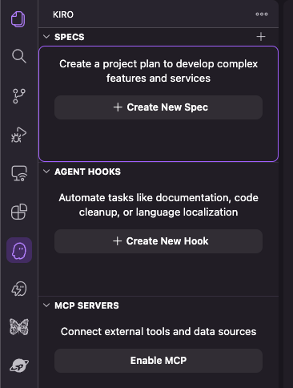

# Prerequisites

## Step 1: Configure npm for Vega Registry

The preview packages for this workshop are on a private npm registry — this step points your npm to it.

1. Back up your existing `.npmrc`:

   > If you don't have an existing `~/.npmrc` file, create a new one instead.

   ```bash
   cp ~/.npmrc ~/.npmrc.bak
   ```

2. Add the following to `~/.npmrc`:

   ```
   @amazon-devices:registry=https://k-artifactory-external.labcollab.net/artifactory/api/npm/rnpreview-npm-prod-local/
   always-auth=true
   strict-ssl=true
   ```

3. Clean your npm cache to avoid conflicts:
   ```bash
   rm -rf node_modules package-lock.json &&
   npm cache clean --force
   ```

## Step 2: Install MCP Server

Install the Amazon Devices Builder Tools MCP server by running the following command in a terminal window:

```bash
# Create a workspace directory for the workshop
mkdir ~/vegaWorkshop && cd ~/vegaWorkshop

# Install MCP and steering document
npx -y @amazon-devices/amazon-devices-buildertools-mcp@latest init-context
```

This will prompt you to select your AI coding assistant and configure the MCP server for it.

To manually configure the MCP server, add the following to your AI agent's MCP settings JSON:

```json
"amazon-devices-buildertools-mcp": {
    "command": "npx",
    "args": ["-y", "@amazon-devices/amazon-devices-buildertools-mcp@latest"],
    "type": "stdio"
}
```

Verify your setup is correct, run the following command in the terminal window:

```bash
npx -y @amazon-devices/amazon-devices-buildertools-mcp@latest check-status
```

You should see your agent's context document and MCP configuration as ✅ Configured.

**Verify MCP Version**:

Run the following command in the terminal window and ensure version is `0.1.25` or higher.

```bash
npx -y @amazon-devices/amazon-devices-buildertools-mcp@latest --version
```

> Don't have an AI coding assistant? Try [Kiro](https://kiro.dev/) — it comes with free credits upon first use.

> ⚠️ **Important:** Enable MCP in your AI Agent if its not enabled by default

_For example, to enable MCP in Kiro IDE click on the 'Enable MCP' button:_



> For detailed MCP setup instructions and verification checkpoints, see the [MCP Server Setup Reference](references/2_set_up_mcp_server.md).

## Step 3: Install Vega SDK (Public)

> Skip this step if you already have the Vega SDK installed.

> Public Vega SDK is sufficient for the MCP workshop exercises (performance debugging, crash debugging, Shaka player upgrade, and Android web app migration).

Open your AI coding assistant that you installed the MCP in the `~/vegaWorkshop` directory and run the following prompt:

```
Help me install Vega SDK
```

The MCP server will guide your AI assistant through the SDK installation.

For full public SDK setup details, see the [Download and Installation Guide](https://developer.amazon.com/docs/vega/0.22/setup-overview.html).

Depending on network speeds, this installation can take 5-15 minutes. We strongly recommend you download and install prior to the workshop.

Additionally, to use our MCP (Model Context Protocol) server or AI prompts you will need at-least one AI Coding assistant such as Cursor, Claude Code, Copilot, Kiro, Amazon Q, Cline, etc. We have included support for these first 6 and have tested primarily on Kiro, Claude Code, and Amazon Q with Claude Sonnet 4/4.5 models - but we expect these prompts to work across most models. To learn more about MCPs, visit [modelcontextprotocol.io/](http://modelcontextprotocol.io/) or see our footnote below.

## Step 4: Install Preview SDK (Only required for RN 0.83 Upgrade)

> Skip this step if you are not participating in the RN 0.83 upgrade session.

1. Install the Vega CLI if you don't already have it (verify with `vega --version`):

   ```bash
   export SKIP_SDK_INSTALL=true
   curl -fsSL https://sdk-installer.vega.labcollab.net/get_vvm.sh | bash && source ~/vega/env
   ```

2. Create a directory for the preview SDK:

   ```bash
   mkdir -p ~/vega_sdk_preview
   ```

3. Run the install command for your platform:

   **Mac Apple Silicon (M-series):**

   ```bash
   curl 'https://kepler-static-artifacts.kepler.labcollab.net/24/240c5fecec4f96b859383d67eecbda642430990d0048a917c3afcd9b12067d72' | bash -s -- --sdk-url='https://kepler-static-artifacts.kepler.labcollab.net/21/21fa7e1d935621b273abaed991ff7239de6b7d72eef497df418d4cdc464bbd81' --version=0.23.6188
   ```

   **Mac Intel:**

   ```bash
   curl 'https://kepler-static-artifacts.kepler.labcollab.net/24/240c5fecec4f96b859383d67eecbda642430990d0048a917c3afcd9b12067d72' | bash -s -- --sdk-url='https://kepler-static-artifacts.kepler.labcollab.net/e2/e2091eaf6c70b871367d6b7520fdc6f5dff3a2dd461c5e2fae28447fca6ebd7b' --version=0.23.6188
   ```

   **Linux x86_64:**

   ```bash
   curl 'https://kepler-static-artifacts.kepler.labcollab.net/24/240c5fecec4f96b859383d67eecbda642430990d0048a917c3afcd9b12067d72' | bash -s -- --sdk-url='https://kepler-static-artifacts.kepler.labcollab.net/76/7663983771c6e88dd36ea73554c4dc321845d76c770d5c4613523d2316596a93' --version=0.23.6188
   ```

4. When prompted for the install location, specify `~/vega_sdk_preview`.
5. **Do not** export any environment variables or PATH from the bootstrapper output.
6. Link and activate the preview SDK:
   ```bash
   vega sdk link --path ~/vega_sdk_preview # Found SDKs should include 0.23.6188 or higher
   vega sdk use 0.23.6188
   vega --version   # verify 0.23.6188 or higher appears
   ```

## Step 5: Fire TV 4K Select with Developer Mode

You will need a Fire TV Stick 4K Select running Vega OS with Developer Mode enabled. See the [Developer Mode setup guide](https://developer.amazon.com/docs/vega/0.22/developer-mode.html) for instructions.

> We recommend bringing an HDMI video capture card if you have one, as we will not have spare TV screens.

## SDK and .npmrc Cleanup After Workshop

To uninstall the preview SDK after the workshop:

```bash
vega sdk uninstall 0.23.6188  # or the preview SDK version at the time of the workshop
```

If you previously had a production SDK installed, validate that the production version is being used once again by running:

```bash
vega -v
```

> ⚠️ **Important:** After the workshop, restore your original `.npmrc` with `cp ~/.npmrc.bak ~/.npmrc`.

---

**Next:** [Clone and Run Reference App](1_clone_and_run_reference_app.md)
