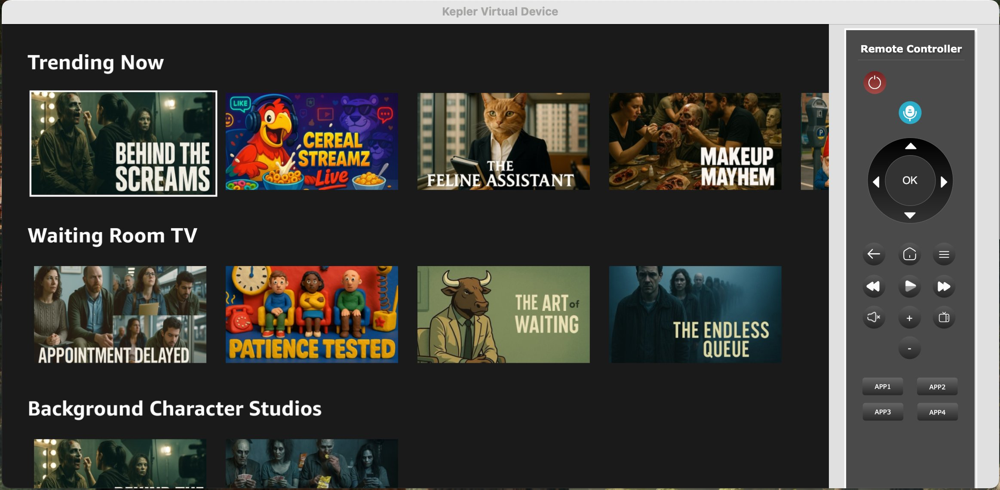
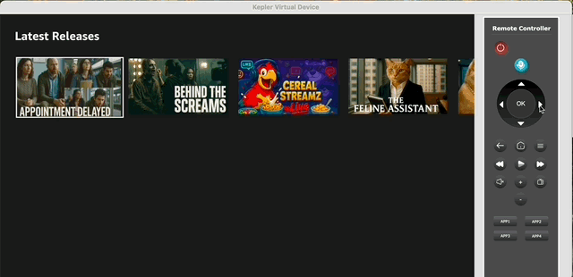

# Phase 1: Clone and Run the Workshop App

In this workshop we'll use a pre-built sample app rather than creating one from scratch. You'll clone the repository, install dependencies, and verify the app runs.

## 1.1: Clone the Workshop App

```bash
git clone https://github.com/efahsl/VegaWorkshopApp.git
cd VegaWorkshopApp
npm install
```

## 1.2: Verify Your Environment

Run `vega --version` to confirm the Vega SDK is installed.

## 1.3: Build and Run the App

Open your AI coding assistant (with the MCP server configured in the prerequisites) and run the following prompt:

```
Build and install my app on the Vega device
```

Your AI assistant will use the MCP tools to build the app and deploy it to your connected Vega device.

Once running, you should see the reference app on your device:





> Throughout the workshop, you'll switch to different branches of this repo for each exercise. Each branch contains a specific scenario (performance bug, crash bug, or Shaka player upgrade) that you'll debug using the MCP server.

---

**Previous:** [Prerequisites](0_prerequisites.md) | **Next:** [Performance Debugging](diagnose_ui_fluidity.md)
