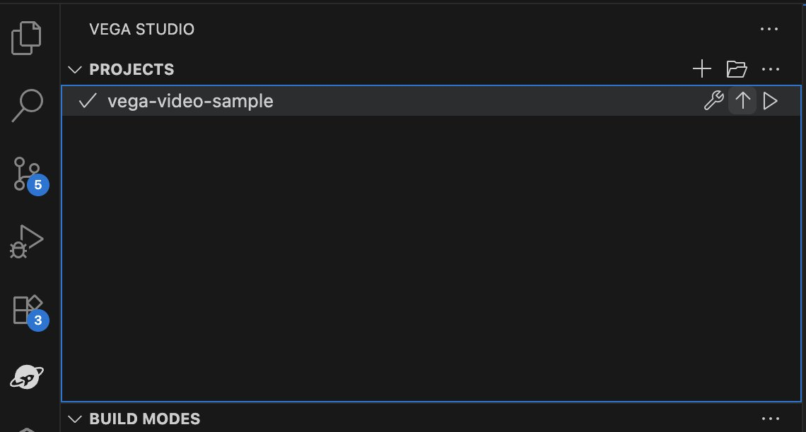
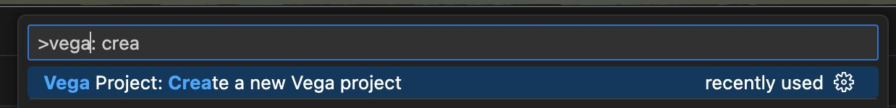
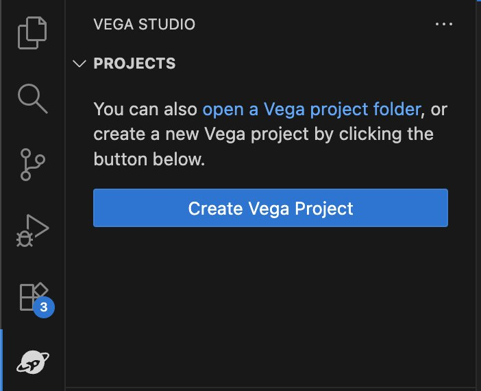
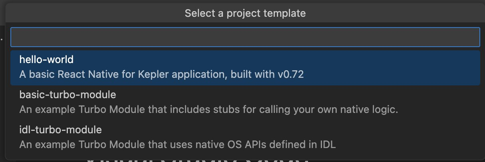
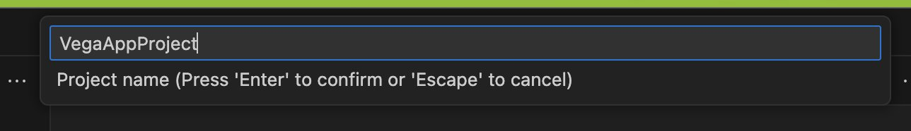
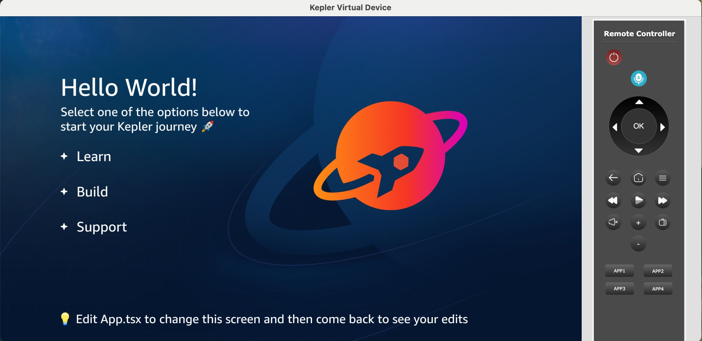
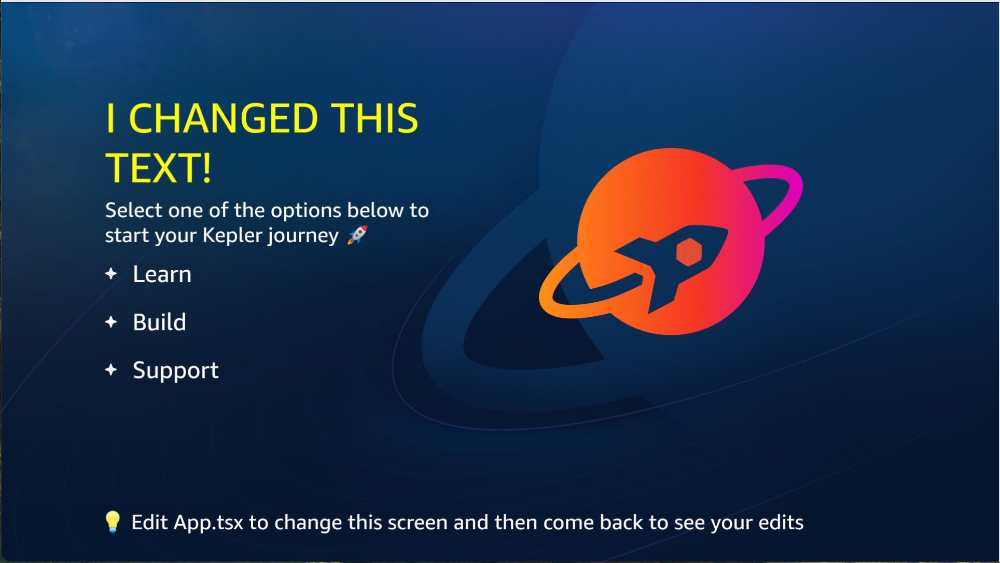
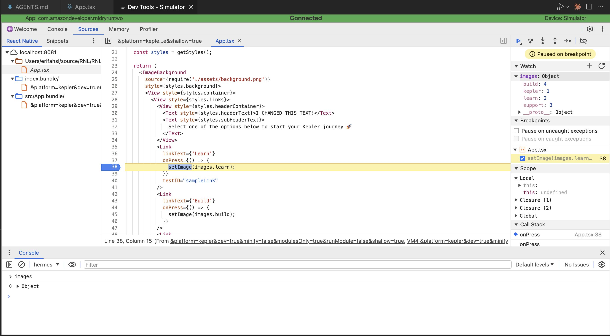

# Phase 1: Create a Hello World App

First we are going to create a Hello World app from our template for which we can build upon.

## 1.1: Environment Setup

Verify your Vega CLI version

Run `kepler --version` command in a terminal window and confirm version is 0.21.X (or higher).

Launch VS Code and verify the Vega Studio side bar appears in VS Code



## 1.2: Create Your First Vega App (Hello World)

**Create Hello World App:**

In the VS Code Command Pallet, run "Vega Project: Create a new Vega project" command and follow steps in the interactive wizard to create the project



Use the "Hello World" template.



VegaStudio asks for a directory to save the project, select one from your workspace

Provide a name for your project:





Add a package ID:


Open Your Created Project in VS Code (if it's not already open)

**Commit changes (Optional, but Recommended)**

Run `git init` in a terminal window in the App project directory and then `git commit` to commit the initial code.

## 1.3: Test Hello World App

**Vega Studio:**

Click on the play icon next to the app project in the Vega side bar.

Note: You can start your app in "Debug" mode, which we generally recommend as this enables Fast Refresh and debugging breakpoints (but is slower), or "Release" mode which is faster and what you would use for submitting your app to the Appstore (but does not allow for fast refresh/breakpoints).

This will install and run the app on the Vega Virtual Device or FireTV Stick




**Recommended Testing (Optional)**

_Fast Refresh (hot reload)_

Modify text in App.tsx to confirm fast refresh is working - this will make the rest of the steps of creating your Vega app significantly easier and faster



_Breakpoints_

Within the "App Performance Tools" of Vega Studio on the bottom-left, you can open "Chrome Dev Tools" add a breakpoint to line 38:

```
setImage(images.learn);
```

Now when you press the Learn button within the emulator, your editor should "break" and you should see the current variables/etc



---

**Previous:** [Prerequisites](0_prerequisites.md) | **Next:** [Set Up MCP Server](2_set_up_mcp_server.md)
