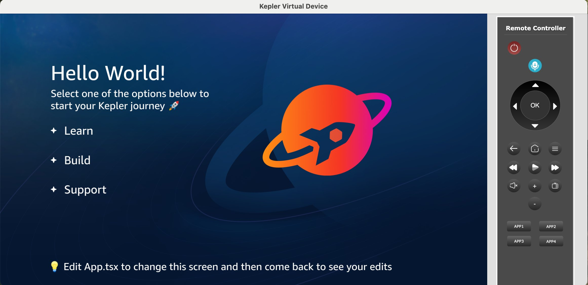
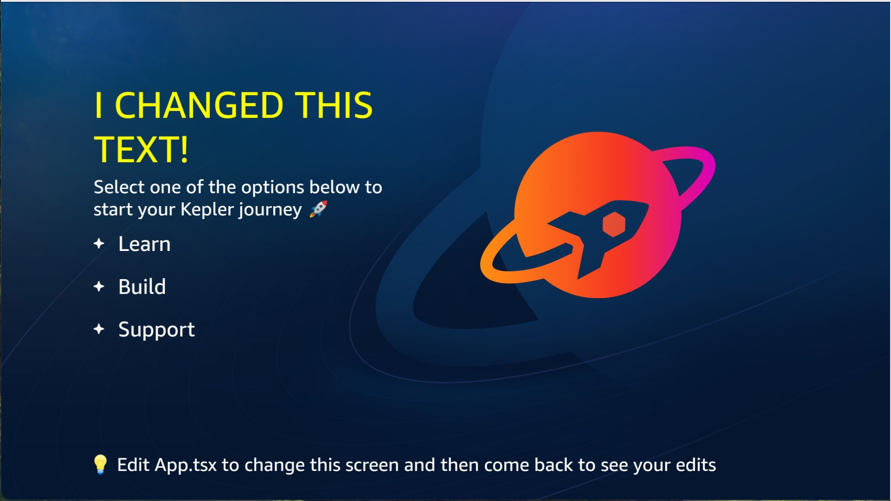
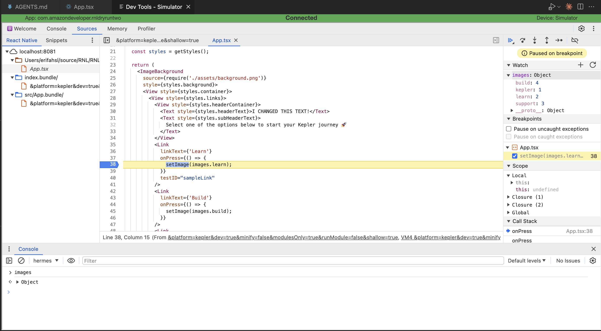
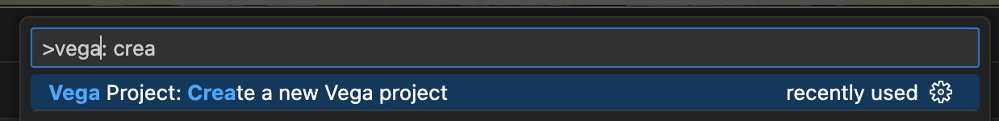
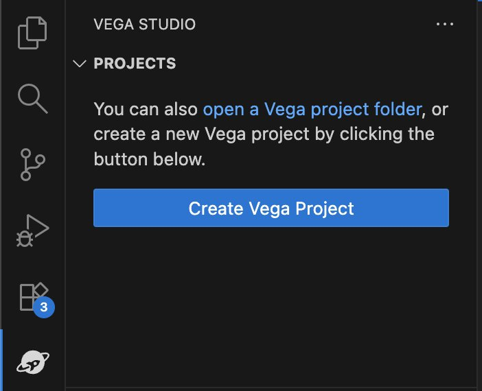
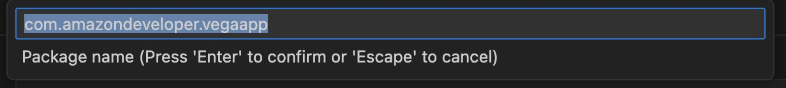
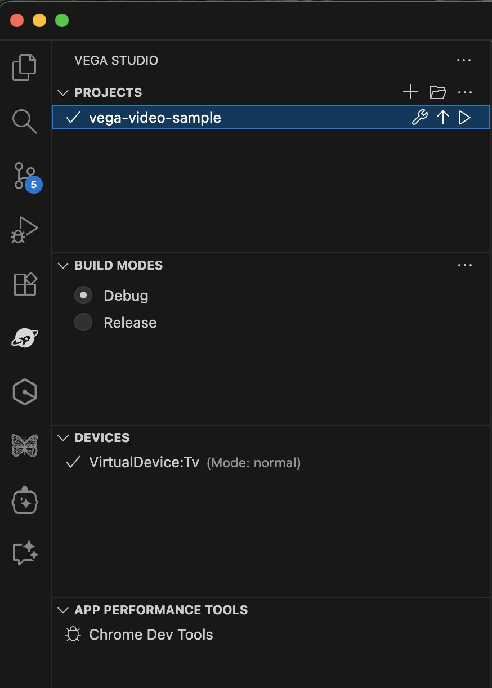

# Phase 1: Create a Hello World App

First we're going to create a Hello World app from the Vega template that we can build on. You installed both **Amazon Devices Builder Tools for AI (ADBT for AI)** and the **Vega SDK** back in [Prerequisites](0_prerequisites.md), so we'll drive this phase through a prompt in your AI agent.

## 1.1 Verify your environment

Make sure the Vega CLI is on your PATH and an SDK is installed:

```bash
vega --version           # Vega CLI (e.g., "Vega CLI Version: 1.3.4")
vega sdk list-installed  # installed SDK version(s)
```

`vega --version` should print a version and `vega sdk list-installed` should list at least one SDK of `0.24.X` or higher. If either fails, go back to [Prerequisites §5](0_prerequisites.md#5-install-the-vega-sdk-via-a-prompt).

## 1.2 Create your first Vega app (Hello World)

**In your AI agent's chat**, from an empty folder you want to work in, run:

```
Help me set up a Vega Hello World app in this folder.

- Use the Vega "Hello World" template
- Pick a sensible project name and package id (ask me if unsure)
- Run `git init` and make an initial commit once the project is created
```

ADBT's onboarding skills (`amazon-devices-vega-setup-sdk`, `amazon-devices-vega-build-and-run`, `amazon-devices-vega-app-manifest`) guide the agent through the correct sequence: it will call the Vega CLI to scaffold the project, populate `manifest.toml`, and initialize git.

**🏁 Checkpoint:** After the agent finishes, you should have a new Vega project directory with:

- `manifest.toml`
- `package.json`
- `src/App.tsx`
- An initial git commit

## 1.3 Test the Hello World App

**In your agent's chat**, run:

```
Build and run this app on the Vega Virtual Device in debug mode.
```

ADBT's `amazon-devices-vega-build-and-run` skill will:

1. Start the Vega Virtual Device (VVD) if it's not already running.
2. Build the app (debug mode gives you Fast Refresh and breakpoints; release mode is faster but no Fast Refresh, you'd use release for App Store submission).
3. Install and launch the app on the virtual device.



### (Optional) Recommended sanity checks

**Fast Refresh (hot reload)**: Modify some text in `src/App.tsx` and save. The app should reload immediately. Fast Refresh is a big time saver for the later phases.



**Breakpoints**: In Vega Studio's "App Performance Tools" panel, open "Chrome Dev Tools" and add a breakpoint at:

```
setImage(images.learn);
```

Press the Learn button in the emulator. Execution should break so you can inspect variables.



---

## Appendix

### Alternative: Create the app in Vega Studio (VS Code)

If you'd rather use the [Vega Studio VS Code extension](https://developer.amazon.com/docs/vega/latest/setup-overview.html) instead of driving through a prompt:

1. In the VS Code Command Palette, run **Vega Project: Create a new Vega project** and follow the interactive wizard.

   

2. Choose the **Hello World** template.

   

3. Choose a directory, project name, and package id when prompted.

   

4. Run `git init` and commit the initial code.

5. Click the ▶ **Play** icon next to the app in the Vega Studio side bar to build and run.

   

Either path, prompt or Vega Studio, produces the same starting point for the rest of the workshop.

---

**Previous:** [Prerequisites](0_prerequisites.md) | **Next:** [Create a 3 Screen App](2_create_3_screen_app.md)
