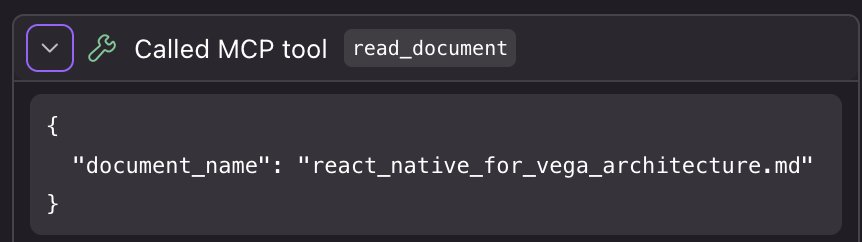
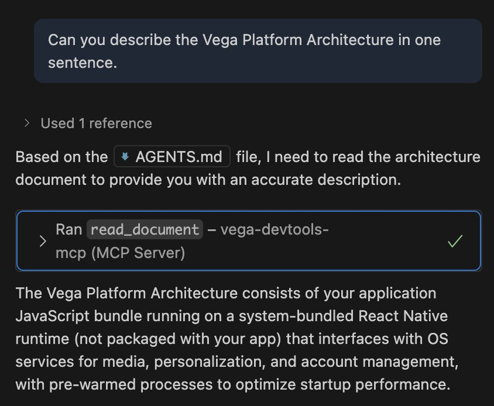
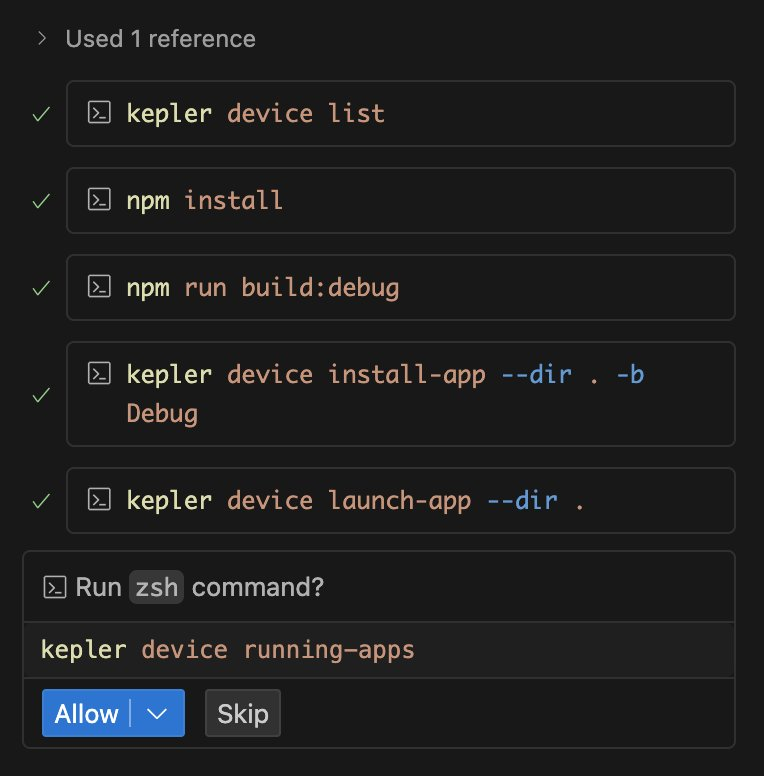
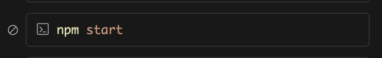

# Phase 2: Set Up MCP Server

## 2.1 Install & Configure Vega MCP Server

While you can use most AI Agent models as-is to make changes to the Vega Hello World App, for better results developing Vega Apps with AI we have a Vega MCP server to provide additional relevant context to your AI Agent. Below we walk through the three required steps to set up the Vega MCP server with your Vega project.

> ℹ️ The steps in these guide have been tested with Claude Sonnet 3.5, 4 & 4.5. While we expect other models to behave similarly, we cannot control the response of every model.
>
> ℹ️ Don't have an AI agent/tool? Try Amazon Kiro, it comes with 500 free credits upon first use and should more than suffice for this workshop: https://kiro.dev/. We use it quite a bit and is one of our favorites!

**Download our Vega MCP Server tarball** *(in the future we will improve this experience, but for now it requires a manual download)* - Download [vega-devtools-mcp.tgz](https://quip-amazon.com/-/blob/XHR9AAz7WE2/Ovlq-285mjReHWvC_FEeHg?name=vega-devtools-mcp.tgz&s=ROPyAzh306H2). Note down the download path.

Run an npm install from the tarball as global scope (or local to your project if you prefer):

```bash
$ npm install -g {PATH_TO_DOWNLOADED_FOLDER}/vega-devtools-mcp.tgz
```

You will now need to add the MCP configuration in your AI Agent's MCP settings.

First, run the following command to get the binary location and copy the location:

```bash
% which vega-devtools-mcp
```

And you'll get an output that *could* be something like:

```
/Users/YOUR_HOME_FOLDER/.nvm/versions/node/v20.19.4/bin/vega-devtools-mcp
```

or the following if node installed via homebrew:

```
/opt/homebrew/bin/vega-devtools-mcp
```

Save this path to your clipboard or another text file, you will need for the next step, which is to update the relevant MCP settings file:

```json
{
  "mcpServers|servers": {
    ...,
    "vega-devtools-mcp": {
      "type": "stdio",
      "command": "node",
      "args": [
        "{YOUR_PATH_TO_VEGA-DEVTOOLS-MCP_BINARY}"
      ]
    }
  }
}
```

### AI Agent MCP Settings File Locations

| # | AI Agent | MCP Settings File Location |
|---|----------|---------------------------|
| 1 | Cursor | `~/.cursor/mcp.json` |
| 2 | Github Copilot | `~/.config/mcp-config.json` or `<project-root>/.vscode/mcp.json` |
| 3 | Claude Code CLI | `~/.claude.json` or `/Library/Application Support/ClaudeCode/managed-mcp.json` |
| 4 | Amazon Q | `~/.aws/amazonq/mcp.json` |
| 5 | Kiro | `~/.kiro/settings/mcp.json` |
| 6 | Cline | `~/Library/Application Support/Code/User/globalStorage/saoudrizwan.claude-dev/settings/cline_mcp_settings.json` |

Note that for those using Claude Code, you can add the MCP server via command line similar to the following:

```bash
claude mcp add --transport stdio vega-devtools-mcp -- node {YOUR_PATH_TO_VEGA-DEVTOOLS-MCP_BINARY}
```

> ℹ️ Important: Start the MCP Server from Agent's MCP config, if not already started - check your current running MCPs to ensure the vega-devtools-mcp is listed as running/connected.

## 2.2 Add Vega Context to AI Agent

The final step to using the MCP server is to add specific project configuration to look up additional prompts/context when using Vega-specific commands/components/libraries/etc. Make sure you are in your project directory.

Run the following command **within your App project**, to initialize Vega context for your AI Coding agent:

```bash
npx vega-devtools-mcp --init-context
```

Choose the AI Agent from the list. Enter 7 for "Other" AI agents not included in the list, to manually copy the Vega context in your project directory.

```
% npx vega-devtools-mcp --init-context

====================================================
🚀 Vega Developer Tools - Initialize Vega Context
====================================================

This tool installs Vega App development context document in your project.
The context document guides AI agents to efficiently answer queries related to app development for Vega OS

Choose from the following options to automatically install Agent specific preset in your app project:

   1. Cursor - Adds AGENTS.md file

   2. Claude Code - Adds CLAUDE.md file

   3. GitHub Copilot - Adds AGENTS.md file

   4. Amazon Q - Adds .amazonq/rules/ directory

   5. Kiro - Adds .kiro/steering/ directory

   6. Cline - Adds .clinerules/ directory

   7. Other AI agent or custom setup - View content only

Select an AI agent (1-7):
```

### Project Context Locations

| # | AI Agent | Project Context Location |
|---|----------|-------------------------|
| 1 | Cursor | `project-root/AGENTS.md` file |
| 2 | Claude Code | `project-root/CLAUDE.md` file |
| 3 | Github Copilot | `project-root/AGENTS.md` file |
| 4 | Amazon Q | `project-root/.amazonq/rules` folder |
| 5 | Kiro | `project-root/.kiro/steering` folder |
| 6 | Cline | `project-root/.clinerules/` folder |

If these do not properly load for you, you can always say the following at the start of any AI agent session: `use AGENTS.md for context`

**Verify AI agent is configured with Vega Context:**

In your AI Agent's chat interface, run the following prompt:

```
Can you describe the Vega Platform Architecture in one sentence.
```

> ℹ️ **Important**: ensure the MCP tool `read_document` is triggered! You will need to grant permission to read, we recommend always allowing for the given workspace. It may look something like the following:

```
vega-devtools-mcp - read_document (MCP)(document_name: "react_native_for_vega_architecture.md")
⎿ #react_native_for_vega_architecture.md

## High-Level Architecture
... +59 lines (ctrl+o to expand)
```

or the following with an AI IDE or extension:



You should get a response similar to:

> Vega is a TV platform that uses a system-bundled React Native runtime (rather than app-bundled), where applications only package their JavaScript code and dynamically link to the OS-provided React Native framework and native services at runtime for optimized performance and resource sharing.

Verify if AI Agent made a tool call to vega-devtools-mcp to read Vega Architecture document.



## [Optional] Use AI To Run Your App via the Vega CLI

*We generally recommend to use the Vega Studio UI to run your app on-device, but we have provided options to run via your AI agent and the Kepler CLI. Depending on your agent, you may have to run "npm start" in a separate terminal manually - this is the Metro server which will also contain the app logs (e.g. console.log).*

**Steps:**

[1] In your AI Agent's chat interface, run the following prompt - *"Run my Vega app on the Vega virtual device in debug mode with fast refresh".*

You should expect the AI agent to run the following tools in order to run your app:



Verify app launches successfully and test basic functionality. Make a change in the App and verify it reflects in the running app.

Skip npm start in the AI agent, by clicking skip and start it manually in a terminal window:



---

[← Previous: Create Hello World App](1_create_hello_world_app.md) | [Next: Create 3 Screen App →](3_create_3_screen_app.md)
