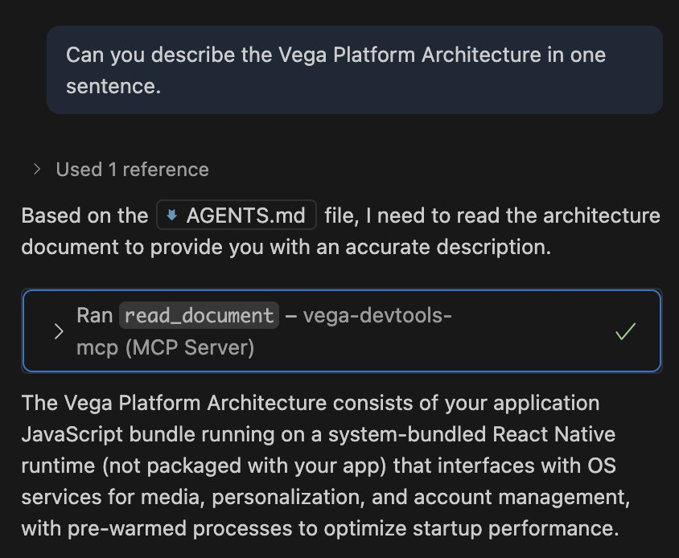
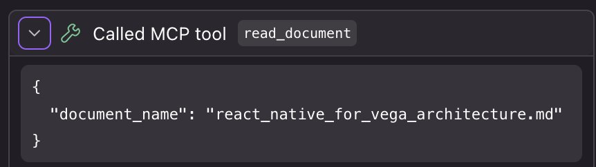

# Phase 2: Set up MCP Server

**Model Context Protocol (MCP)** is an open standard that defines how AI applications can securely connect to external tools, data sources, and services. MCP acts like a "USB port for AI applications" - providing a standardized way to connect AI models to different systems to access external knowledge/capabilities without requiring additional training. Common examples include connecting AI agents to file systems for reading/writing files, accessing web search engines and APIs, connecting to communication tools like Slack or email systems, and providing specialized development tools and workflows (which is what we are going to use it for).

You can learn more about the protocol specification at [modelcontextprotocol.io/](http://modelcontextprotocol.io/).

## 2.1 Install & Configure Amazon Devices Builder Tools MCP

While you can use most AI Agent models as-is to make changes to the Vega Hello World App, for better results developing Vega Apps with AI we have an MCP server to provide additional relevant context to your AI Agent.

> ℹ️ The steps in these guide have primarily been tested with Claude Sonnet 3.5, 4 & 4.5, using Copilot, Kiro, Claude Code, and Amazon Q. While we expect other models and tools to behave similarly, we cannot control the response of every model/tool.
>
> ℹ️ Don't have an AI agent/tool? Try Amazon Kiro, it comes with 500 free credits upon first use and should more than suffice for this workshop: <https://kiro.dev/>. We use it quite a bit and is one of our favorites!

> ⚠️ **Migration Notice**: If you previously installed `vega-devtools-mcp`, please remove it from your MCP settings and follow the steps below to install the new `@amazon-devices/amazon-devices-buildertools-mcp` package.

### 2.1.1 Install MCP Server & Add Vega Context

The easiest way to install is via one-click install from the npm package page:

**[Install from npm →](https://www.npmjs.com/package/@amazon-devices/amazon-devices-buildertools-mcp)**

The page provides one-click install buttons for Kiro, Cursor, and VSCode.

For other AI agents, or to install manually, run the following command **within your App project**:

```bash
npx -y @amazon-devices/amazon-devices-buildertools-mcp@latest --init-context
```

This interactive command will:
1. Display available AI agents and let you select your preferred one
2. Update your agent's MCP settings to configure the MCP server
3. Create the appropriate Vega context file for your chosen AI agent

To manually configure the MCP server, add the following to your AI Agent's MCP settings JSON:

```json
"amazon-devices-buildertools-mcp": {
    "command": "npx",
    "args": ["-y", "@amazon-devices/amazon-devices-buildertools-mcp@latest"],
    "type": "stdio"
}
```

> ℹ️ Important: Start the MCP Server from Agent's MCP config, if not already started - check your current running MCPs to ensure the amazon-devices-buildertools-mcp is listed as running/connected.

**🏁 Checkpoint: Verify MCP is installed in your AI Agent**

In your AI Agent's chat interface, run the following prompt:

```
List the tools provided by Amazon Devices Builder Tools MCP
```

You should see a response that includes 4 tools:
- `read_document`
- `list_documents`
- `analyze_perfetto_traces`
- `get_app_hot_functions`

**🏁 Checkpoint: Verify AI agent is configured with Vega Context**

In your AI Agent's chat interface, run the following prompt:

```
Can you describe the Vega Platform Architecture in one sentence?
```

> ℹ️ **Important**: ensure the MCP tool `read_document` is triggered! You will need to grant permission to read, we recommend always allowing for the given workspace. It may look something like the following:

```
amazon-devices-buildertools-mcp - read_document (MCP)(document_name: "react_native_for_vega_architecture.md")
⎿ #react_native_for_vega_architecture.md

## High-Level Architecture
... +59 lines (ctrl+o to expand)
```

or the following with an AI IDE or extension:





You should get a response similar to:

```
Vega is a TV platform that uses a system-bundled React Native runtime (rather than app-bundled), where applications only package their JavaScript code and dynamically link to the OS-provided React Native framework and native services at runtime for optimized performance and resource sharing.
```

---

**Previous:** [Create a Hello World App](1_create_hello_world_app.md) | **Next:** [Create a 3 Screen App](3_create_3_screen_app.md)
