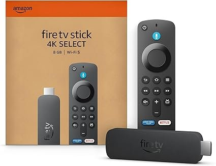
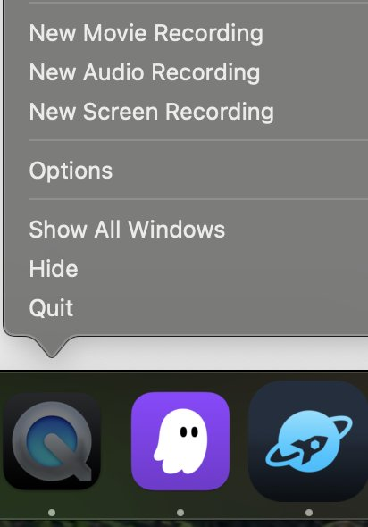

# CHECKPOINT: Get your Vega Fire TV Stick Device!

Once you have your Hello World app running with Fast Refresh enabled AND your Vega MCP server running, you are ready to develop your 3 screen app!

So to get your Vega Fire TV Stick, talk to one of the workshop session support staff and show:

1. Your Hello World app running on the Vega Virtual Device. Make a change on App.tsx (or any other component), save, and show the app has updated automatically on the Virtual Device.

2. Open a new session with your AI agent, and ask to:
   ```
   describe the benefits of the vega platform architecture over standard react native in 2 sentences or less.
   ```
   *We are looking to ensure your MCP server is called and the "read_document" command is triggered.*



## Configure and run the App on your FireTV Stick

Lets connect the FireTV Stick to the development machine and test our app on the device.

> If you have already setup and ran your app on a FireTV stick, you can skip this milestone

**Steps:**

Plug in your Fire TV stick to both an HDMI screen and USB power - whether through your laptop or a power outlet (note that you will need to be plugged in via USB for later steps).

*If you do not have an extra TV/monitor/etc - you can consider using an HDMI capture card to view the contents of the Fire TV Stick on your laptop using Quicktime/OBS/etc.*



You will need to connect to wifi and complete login/registration steps on the FireTV stick using your FireTV Stick Remote, and then you should be able to see your Fire TV UI below (this is called the "Launcher App").


**Developer Mode:**

Developer Mode provides access to the device shell, it is required for you to be able to side-load, test, and debug apps on physical devices. For more details see [here](https://developer.amazon.com/docs/vega/0.21/developer-mode.html). For Vega based devices, only registered developers can access and enable developer mode shell. We have already allow-listed the devices that we shared to access developer mode but the developer mode is not yet enabled, refer step-3 in the page [here](https://developer.amazon.com/docs/vega/0.21/run-apps.html#ftv-tab) to enable developer mode on your device. 

**Run your app**

Next, we will run the app we've built on the Fire TV device itself. Performance testing is best done on a 'release' build to get accurate performance baselines.

In the Vega Studio side bar, select the FireTV Stick device under "Devices" panel and "Release" under "Build Modes', then click the play icon next to the project to build and run the app on the device.


You should now see your app running on your TV device, and be able to navigate the screens via the remote control.

---

**Previous:** [Set Up MCP Server](2_set_up_mcp_server.md) | **Next:** [Create a 3 Screen App](3_create_3_screen_app.md)
