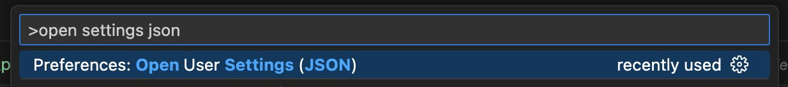
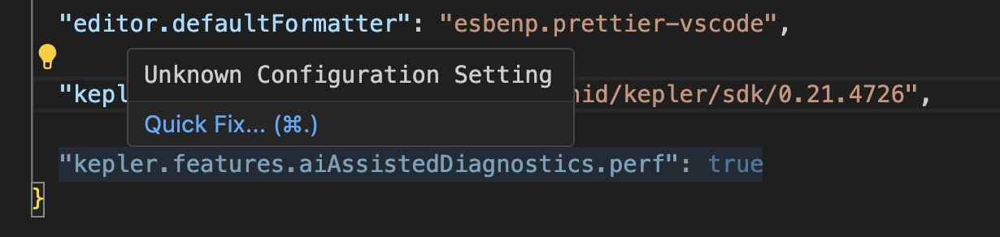
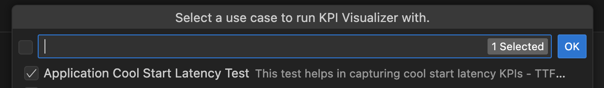
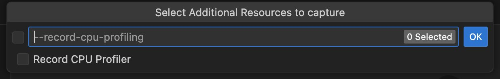
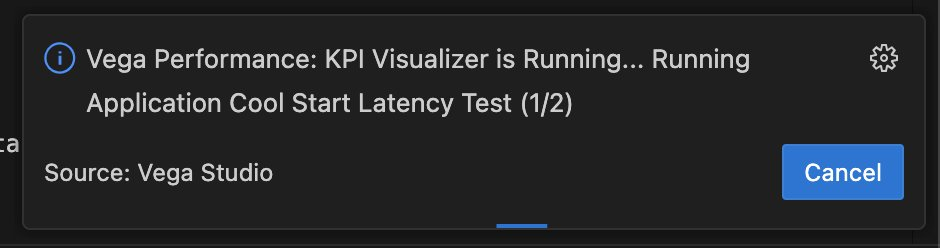
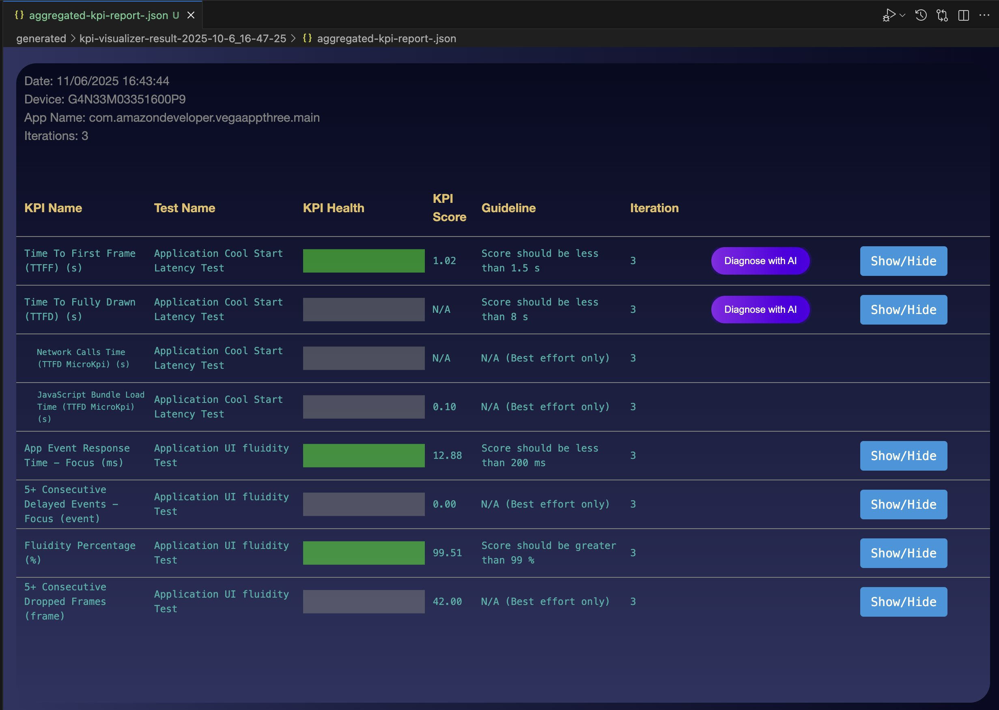
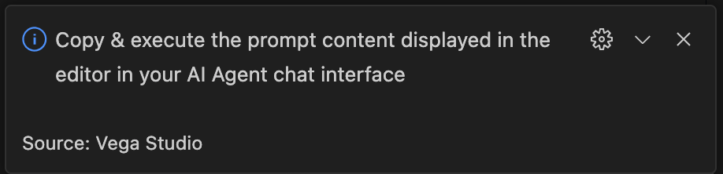
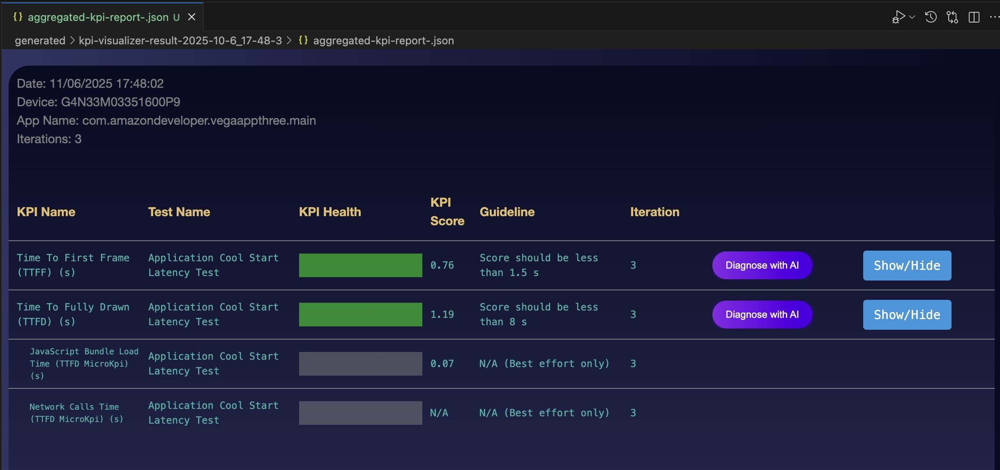

# Phase 4: Performance Testing & Analysis

Now let's do some performance benchmarking! Note that performance tools are only supported on the physical Vega Fire TV stick. If you have not set up your Fire TV stick in previous steps, please go back and do so.

## 4.1: Performance Analysis

Next, we will run a performance test of the app on our physical device to get a performance baseline.

Build your app in **“release”** mode before running a performance test. A release build is required to accurately measure performance, apply targeted performance optimizations and re-measure to verify performance improvements.

Add the following config to your VS Code settings file. This config enables _"AI-Assisted Diagnosis"_ feature in Vega Studio.

```json
{
 ...,
 "kepler.features.aiAssistedDiagnostics.perf": true
}
```

You can open VS code settings JSON, by running the following command in VS Code Command Pallet:



You might see a warning in VS Code settings, you can safely ignore it:



**Run Performance Performance test:**

Connect a FireTV stick device and run "App KPI Visualizer" tool from Vega Studio side bar in VS Code


Select following options in the wizard:

KPIs: Choose - 'Cool Start Latency' - _you may choose additional KPIs in the check list. Each test runs sequentially, so takes longer to execute_



Uncheck "Record CPU Profiler" - _this option records a CPU profiler trace to deep-dive further into performance issues_



Select defaults for all other options in the wizard

Select "No" for the following:

_This option is only shown for subset of test cases. Selecting "No" will run a default UI automation script. Otherwise you can create a new custom Appium based UI automation script and use that._


Once KPI Visualizer starts, you should see a notification window as below



After the test starts, KPI Visualizer will automatically run the app and measure KPIs:

- For _"Application Cool Start Latency"_ test, KPI Visualizer launches the App and measure launch latency
- For _"Application UI Fluidity"_ test, KPI Visualizer runs a pre-defined D-Pad remote automation script in the App and automatically measures UI Fluidity, Dropped Frames and Application Responsiveness time.

**Analyze performance report**

The Performance report is automatically opened after performance test is completed



You can also manually open the KPI report file, by navigating to the `<project-root>/generated` directory and clicking on the `app-launch-kpi-report-*.json` file.

If you run multiple tests at once a `aggregated-kpi-report-.json` file is created in the `generated` directory.

## 4.2: AI-Assisted Diagnosis

KPI report includes a "Diagnose with AI" Action, that automatically executes pre-defined steps in your AI agent to diagnose a performance issue in your App.

**[1] In the KPI report UI, click on "Diagnose with AI" action next to 'Time To Fully Drawn (TTFD) (s)' KPI**

This should kick off AI-Assisted Diagnosis for TTFD KPI in your AI Agent.

_If your AI agent is not accessible by Vega Studio, the prompt content is opened in a text editor. Copy-paste the prompt content shown the active text editor in your AI agent's chat window. You should see the following notification pop-up in VS Code in this case:_



If your App is already meeting KPI guidelines (GREEN), your AI Agent may respond with a message like: _the KPI is already meeting expected standards, no further diagnosis is required._

In this case ask your AI Agent to ignore the thresholds and further optimize the KPI; prompt: _"Please help improve this KPI with the instructions provided earlier in the prompt. Ignore the KPI threshold check, I want to improve the KPI value even though it is within the threshold."_

You should expect a response indicating that `useReportFullyDrawn()` callback is not invoked in the App.

If your AI Agent doesn't automatically implement the recommended changes, ask your AI Agent to implement them by giving a prompt: `"implement the recommended changes"`.

Your AI Agent should then install `npm install @amazon-devices/kepler-performance-api` library and invoke the `useReportFullyDrawn()` callback.

Example of AI Agent changes in App.tsx to invoke `useReportFullyDrawn()`:

```typescript
import {useKeplerAppStateManager} from '@amazon-devices/react-native-kepler';
import {useReportFullyDrawn} from '@amazon-devices/kepler-performance-api';
...
export const App = () => {
  const reportFullyDrawnCallback = useReportFullyDrawn();
  const keplerAppStateManager = useKeplerAppStateManager();
  const [appState, setAppState] = useState(
    keplerAppStateManager.getCurrentState(),
  );

  // Emit fully drawn marker on the first draw after warm launch.
  const handleAppStateChange = useCallback(
    (stateChange: any) => {
      if (
        appState.match(/^(inactive|background)$/) &&
        stateChange === 'active'
      ) {
        reportFullyDrawnCallback();
      }
      if (stateChange.match(/^(inactive|background|active|unknown)$/)) {
        setAppState(stateChange);
      }
    },
    [appState, reportFullyDrawnCallback],
  );

  useEffect(() => {
    const changeSubscription = keplerAppStateManager.addAppStateListener(
      'change',
      handleAppStateChange,
    );
    return () => {
      changeSubscription.remove();
    };
  }, [handleAppStateChange, keplerAppStateManager]);

  return (
    <NavigationContainer>
      <Stack.Navigator
        initialRouteName="Home"
        screenOptions={{
          headerShown: false,
        }}>
        <Stack.Screen name="Home" component={HomeScreen} />
        <Stack.Screen name="Details" component={DetailsScreen} />
      </Stack.Navigator>
    </NavigationContainer>
  );
};
```

**⚠️ Important**: Check the placement of "useReportFullyDrawn()" callback. Invoking `useReportFullyDrawn()` pre-maturely leads to incorrect TTFD KPI values.

- For cool start, it must be invoked in the component that is first shown to the user on launch, after the component is fully mounted. Adjust the placement of useReportFullyDrawn() in the useEffect accordingly.
- For warm start, it must be invoked within app state manager handlers

For example, in case of an app that displays the first screen in a HomeScreen.tsx component, move the call to `useReportFullyDrawn()` in a `useEffect` of HomeScreen **& remove it from App.tsx**.

```typescript
import {useReportFullyDrawn} from '@amazon-devices/kepler-performance-api';

export const HomeScreen = ({navigation}: Props) => {
  const [contentRows, setContentRows] = useState<ContentRow[]>([]);
  const [loading, setLoading] = useState(true);
  const [focusedId, setFocusedId] = useState<string | null>(null);
  const reportFullyDrawnCallback = useReportFullyDrawn();

  // Example of calling useReportFullyDrawn() after the
  // component that is first shown to the user is mounted
  useEffect(() => {
    reportFullyDrawnCallback();
  }, [reportFullyDrawnCallback]);

  useEffect(() => {
    fetchMovies();
  }, []);
```

After you apply the code changes, re-build your App in **"release"** mode again and re-run KPI Visualizer with "Application Cool Start Latency Test". You can optionally include "Application Warm Start Latency Test" as well to test warm start launch scenario

Once the test is complete, you should see that TTFD KPI has a value instead of N/A



**[2] In the KPI report UI, click on "Diagnose with AI" action next to 'Time To First Frame (TTFF) (s)' KPI**

This should kick off AI-Assisted Diagnosis for TTFF KPI in your AI Agent.

_If your AI agent is not accessible by Vega Studio, the prompt content is opened in a text editor. Copy-paste the prompt content shown the active text editor in your AI agent's chat window. You should see the following notification pop-up in VS Code in this case:_


If your App is already meeting KPI guidelines (GREEN), your AI Agent may respond with a message like: _the KPI is already meeting expected standards, no further diagnosis is required._

In this case ask your AI Agent to ignore the thresholds and further optimize the KPI; prompt: `"Please help improve this KPI with the instructions provided earlier in the prompt. Ignore the KPI threshold check, I want to improve the KPI value even though it is within the threshold."`

You should expect a response indicating that **Native Splash Screen is NOT implemented in the App.**

AI Agent should then automatically implement the SplashScreen manager APIs in your app.

SplashScreen Manager requires a 'SplashScreenImages.zip' file that includes splash screen assets.

Ask your AI agent to create this file, by providing an input image; prompt: _"Please create the SplahScreenImages.zip file using this image "./src/assets/background.png"._

Alternatively, you can provide any 1920x1080 pixels .png image of your choice.

Follow the agent workflow and verify the zip file is created properly in `<project-root>/assets/raw/SplashScreenImages.zip`.

Apply the code changes, then re-build your app in **"release"** mode & re-run your app to verify Splash Screen shows up when you launch the app on the device.

After confirming Splash screen is working, re-run KPI Visualizer and verify improvements in TTFF KPI.

---

**Previous:** [Create a 3 Screen App](3_create_3_screen_app.md) | **Next:** [Performance Improvements](5_performance_improvements.md)
