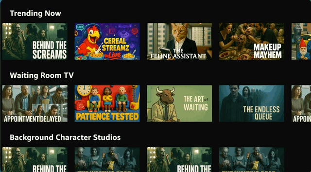

# Phase 5: Optimize App Performance

TV apps require smooth 60fps performance for a good user experience. In this phase, we'll identify and fix common React Native performance issues—specifically unnecessary re-renders that cause lag during D-pad navigation.

## 5.1: Create a Performance Problem

Before optimizing, let's add a feature that can further expose performance issues. We'll add a dynamic background image that changes based on the focused item.

**Prompt:**

```
Update HomeScreen.tsx to add a full-screen background image that matches the currently focused thumbnail. Use images.poster_16x9 from the data. Add a semi-transparent dark overlay so the content remains visible. Keep the implementation simple—no memoization yet.
```

**Expected result:**
- A state variable tracks the focused item
- Background Image displays the poster
- Dark overlay ensures text readability
- Focus handlers update the background

```typescript
const [backgroundImage, setBackgroundImage] = useState<string>('');

const handleItemFocus = (item: MovieItem) => {
  setBackgroundImage(item.images.poster_16x9);
};

return (
  <View style={styles.container}>
    {backgroundImage && (
      <>
        <Image source={{ uri: backgroundImage }} style={styles.backgroundImage} />
        <View style={styles.overlay} />
      </>
    )}
    {/* Content rows */}
  </View>
);
```



### Test the Performance Impact

Navigate through your content rows with the D-pad. You'll likely notice:
- Lag or stuttering during quick navigation
- The app feels less responsive

This happens because every focus change triggers a state update, causing the entire HomeScreen and all its children to re-render—even components whose data hasn't changed.

### Re-Measure KPIs

We can measure an additional UI fluidity baseline to see how this change negatively impacted the CX.

**Prompt:**

```
Rebuild in release mode and re-install the app to the device. Use the Vega CLI tool to again run the ui-fluidity test from the Vega kpi-visualizer tool. Save the results to another file (ui-fluidity-after-changes.md), and compare these results to our original baseline (ui-fluidity-baseline.md).
```

---

## 5.2: Optimize FlatList Performance

FlatList itself can be a bottleneck. We have two options, we can tune/optimize the FlatList or we can replace with a native Vega Carousel component. 

### Option A: Tune FlatList Props

**Prompt:**

```
Optimize the FlatList components in HomeScreen for TV performance. Add windowSize, maxToRenderPerBatch, initialNumToRender, removeClippedSubviews, and getItemLayout.
```

**Expected result:**
```typescript
<FlatList
  data={items}
  renderItem={renderItem}
  keyExtractor={item => item.id}
  horizontal
  windowSize={5}
  maxToRenderPerBatch={5}
  initialNumToRender={5}
  removeClippedSubviews={true}
  getItemLayout={(data, index) => ({
    length: ITEM_WIDTH,
    offset: ITEM_WIDTH * index,
    index,
  })}
/>
```

### Option B: Replace with Vega Carousel

The Vega Carousel is a native component optimized for TV navigation.

> **Note:** The Vega Carousel component requires native modules that may not available on the virtual device. If you are using the Vega Virtual Device, you may encounter crashes or missing module errors (e.g., `INativeUiComponents_13`). For best results, use a physical Vega Fire TV stick for this step. If you only have a virtual device, consider sticking with the optimized FlatList approach.

**Prompt:**

```
Replace the FlatList rows in HomeScreen.tsx with the Vega Carousel from @amazon-devices/kepler-ui-components. Keep the same images and dimensions. Use FocusIndicator="fixed".
```

The Carousel provides smoother scrolling and better performance, especially on-device.

**Before (FlatList):**


**After (Carousel):**


---

## 5.3: Detect Unnecessary Re-renders

Now let's identify exactly which components are re-rendering and why. We'll use our BuilderTools built-in prompt capability to set up **Why Did You Render (WDYR)**, a tool that logs unnecessary re-renders to the console, and then provide analysis before/after the changes.

First let's check what prompts are available to us. In a CLI-based tool like Claude Code or Kiro CLI, you can use 

```
/prompts
```

Which would display an output similar to the following:

```
Prompt                               Description                              Arguments (* = required)
▔▔▔▔▔▔▔▔▔▔▔▔▔▔▔▔▔▔▔▔▔▔▔▔▔▔▔▔▔▔▔▔▔▔▔▔▔▔▔▔▔▔▔▔▔▔▔▔▔▔▔▔▔▔▔▔▔▔▔▔▔▔▔▔▔▔▔▔▔▔▔▔▔▔▔▔▔▔▔▔▔▔▔▔▔▔▔▔▔▔▔▔▔▔▔▔▔▔▔▔▔▔▔▔▔▔▔▔▔▔▔▔▔▔▔▔▔▔▔▔▔▔▔▔▔▔▔▔▔▔▔▔▔▔▔▔▔▔▔▔▔▔▔▔▔▔▔▔▔▔▔▔▔▔▔▔▔▔▔▔▔▔▔▔▔▔▔▔▔▔▔▔▔▔▔▔▔▔▔
amazon-devices-buildertools-mcp (MCP):
- apply_performance_best_practices   Diagnose and optimize React Native ap... app_source_path*
- detect_component_re-renders        Diagnose and optimize Vega applicatio... vega_app_package_path*
- diagnose_kpi_ttfd                  Diagnose Vega application's Time to F... kpi_report_file_path*, kpi_to_diagnose*
- diagnose_kpi_ttff                  Diagnose Vega application's Time to F... kpi_report_file_path*, kpi_to_diagnose*
- fix_hot_functions                  Diagnose and optimize Vega applicatio... trace_data_file_path
- upgrade_carousel_component         Assists in migrating to newer version... current_implementation_file_path*, current_version*, target_version*
```

We are going to use the `detect_component_re-renders` prompt, which requires a single argument of the vega app package path.

**Prompt:**

```
@detect_component_re-renders ./
```

_(This assumes you are already running in your current development directory.)_ 
Follow the on-screen instructions. This prompt workflow will execute the following steps:

- Enable Why-did-you-render
- Build and Run the app, logs automatically captured on disk
- (Manual) User must navigate through the CX on the app to trigger the why-did-you-render logs
- (Manual) User must type "STOP" in prompt to pause collection of logs and begin next steps
- Analyze the logs and identify the main culprits for re-renders
- Code analysis and recommended changes

Once this is complete, the agent will provide a detailed breakdown of the root causes and specific code changes needed and should result in noticeable performance improvements.

**🏁 Checkpoint:** After running the WDYR analysis, your agent should identify specific components causing unnecessary re-renders and recommend fixes using `React.memo`, `useCallback`, and/or `useMemo`.

---

<details>
<summary><strong>Understanding the Fixes</strong> — To see details on the types of fixes most commonly made, expand this section.</summary>

For this app, WDYR _typically_ identifies these types of issues:

1. **Components re-render when props haven't changed** — need `React.memo`
2. **Functions are recreated every render** — need `useCallback`
3. **Arrays/objects are recreated every render** — need `useMemo`

```
Without optimization:
Focus change → HomeScreen renders → ContentRow renders → ThumbnailItem renders (×50)

With optimization:
Focus change → HomeScreen renders → ContentRow skips → ThumbnailItem skips
```

1. Parent re-renders (background image state changed)
2. `useMemo` returns the same array references
3. `useCallback` returns the same function references
4. `React.memo` sees identical props → skips re-render ✅

**Note:** 
- `React.memo` alone won't help if props are recreated every render
- `useMemo`/`useCallback` alone won't help if components aren't wrapped in `React.memo`

---

### Expected Performance Impact

When making these fixes and running traces, we have seen dramatic improvements:

| Metric | Before | After | Improvement |
|--------|--------|-------|-------------|
| Process CPU (avg) | 56% | 13.5% | **75.9% reduction** |
| Peak CPU | 120% | 60% | 50% reduction |
| System CPU (avg) | 175% | 136% | 22% reduction |
| Memory (avg) | 157 MB | 163 MB | +4.3% (expected) |

**Component renders per focus change:**
- Before: ~150+ renders (HomeScreen + 5 ContentRows + ~50 ThumbnailItems each)
- After: 1 render (just HomeScreen)

The 75.9% CPU reduction proves the app was wasting most of its processing power on redundant renders - and remember this is a very simple app! The slight memory increase (~6 MB) is the cost of caching—a worthwhile trade-off.

Coming soon, we are going to re-measure the UI fluidity metrics to validate the improvements.

</details>

---

## 5.5: Re-run Performance Checks

Let's do a final UI fluidity measurement to see how we have improved the performance.

**Prompt:**

```
Rebuild the app in release mode and re-install the app to the device. Use the Vega CLI tool to again run the ui-fluidity test from the Vega kpi-visualizer tool. Save the results to another file (ui-fluidity-after-optimizations.md), and compare these results to our previously measured measurement files.
```

## Summary

In this phase, you learned to:
1. **Identify** performance issues using Why Did You Render
2. **Fix** unnecessary re-renders with `React.memo`, `useCallback`, and `useMemo`
3. **Measure** improvements (75% CPU reduction in our tests)
4. **Optimize** FlatList or replace with native Carousel

These patterns are essential for TV apps where D-pad navigation triggers frequent state updates.

---

**Previous:** [Performance Testing](4_performance_testing.md) | **Next:** [Accessibility](6_accessibility.md)

---

<details>
<summary><strong>Additional Debugging Tools</strong></summary>

### React DevTools Profiler

While WDYR detects *unnecessary* re-renders, the React DevTools Profiler shows the *time cost* of each render.

**Setup:**
1. Install React DevTools: https://react.dev/learn/react-developer-tools
2. Open DevTools → Profiler tab
3. Record while navigating with D-pad
4. Review the flame graph

**Look for:**
- Yellow/red components (slow renders)
- Components rendering too frequently
- Render cascades from parent to children

**Note:** For Vega apps on Fire TV, use remote debugging.

### Apply Performance Best Practices (MCP Prompt)

The Builder Tools MCP server includes an `apply_performance_best_practices` prompt that can automatically diagnose and optimize your React Native app's performance. It analyzes your source code for common performance anti-patterns and suggests fixes.

**Prompt:**

```
@apply_performance_best_practices ./src
```

This will scan your app source path and provide recommendations for memoization, render optimization, and other React Native performance improvements specific to Vega.

### ESLint Plugin for React Compiler

React 19's compiler will automatically add memoization. While Vega currently uses React 18 (RN 0.72), you can prepare your code now.

**Prompt:**

```
Enable eslint-plugin-react-compiler on this project and run the linting rules.
```

**Or manually:**
```bash
npm install --save-dev eslint-plugin-react-compiler
```

```json
// .eslintrc
{
  "plugins": ["react-compiler"],
  "rules": {
    "react-compiler/react-compiler": "error"
  }
}
```

The plugin catches patterns that prevent automatic optimization: mutating state directly, side effects in render, conditional hooks, etc.

**Current recommendation:** Continue using manual memoization. The plugin helps write future-proof code.

</details>

<details>
<summary><strong>Alternative: Manual WDYR Setup</strong></summary>

If you prefer to set up Why Did You Render manually instead of using the `@detect_component_re-renders` prompt:

**Prompt:**

```
I want to check for excess re-rendering. Help me set up Why Did You Render for Vega, in order to detect unnecessary re-renders in HomeScreen.tsx. Walk me through the setup and help me analyze the output.
Configure WDYR with trackAllPureComponents: true, logOnDifferentValues: false, and collapseGroups: true to keep output concise - I want to see which components re-render and why, but not the full prev/next object value diffs.
Don't rebuild the app or any other further steps, I'll do that myself. 
```

_(Note that the current prompt in the MCP server may try to automatically build/run the app - we are not doing that in this manual mode, which is why we used that last sentence in the prompt above.)_

The agent will:
1. Install `@welldone-software/why-did-you-render` as a dev dependency
2. Configure `babel.config.js` and create `wdyr.tsx`
3. Import it at the top of `index.js`

You will need to rebuild and re-run the app. Once running, navigate through your list a few times and watch your Metro console logs (they may be quite large). WDYR will show messages like:

```
ContentRow Re-rendered because the props object itself changed 
but its values are all equal.
```

This tells you the component re-rendered unnecessarily—the data was identical, but React saw different object references.

You will need to _manually_ analyze the WDYR output back to your agent to find the exact components and props causing issues.

**Prompt:**

```
This is my console output...
{PASTE LOG SNIPPET}
```

(Beware context overflow — you likely will NOT be able to paste the entire log.)

</details>
