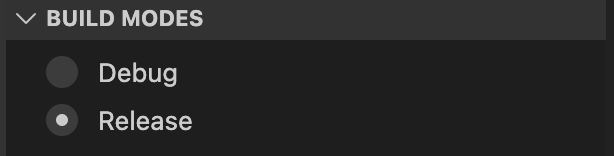
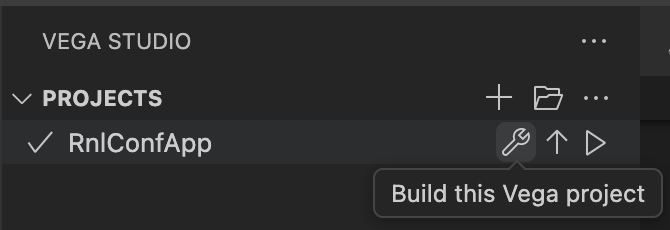

# Diagnose and Fix App Crashes Using AI-Assisted Analysis

TV apps must handle edge cases gracefully to provide a reliable user experience. In this guide, we'll use the Amazon Devices BuilderTools MCP server to diagnose and fix app crashes through automated stack trace analysis and root cause identification.

## Prerequisites

Before starting this workshop, make sure you have the following ready:

- [ ] Open your IDE in the sample app root directory
- [ ] Follow [Install Vega Developer Tools](https://developer.amazon.com/docs/vega/latest/install-vega-developer-tools.html) to install required Vega tools
- [ ] Verify [Vega Studio extension](https://developer.amazon.com/docs/vega/latest/setup-extension.html) is installed in VS Code (automatically configured during Vega SDK installation)
- [ ] Install the Amazon Devices BuilderTools MCP server and initialize steering context
- [ ] Verify the MCP server is connected by asking the agent: "What is Vega Architecture?"
  - The agent should read `react_native_for_vega_get_started.md` and respond with details about split bundle architecture, process pre-warming, and component types

---

## About the Bug

The `crash-demo` branch contains intentional JavaScript runtime crashes in `AdvancedFeaturesScreen.tsx` that demonstrate three common crash patterns:

1. **Null Reference Error** - Accessing properties on a `null` object
2. **Undefined Property Error** - Accessing properties that don't exist in the interface
3. **Array Bounds Error** - Accessing array indices that are out of bounds

Here's what the problematic code looks like in `AdvancedFeaturesScreen.tsx`:

```tsx
export const AdvancedFeaturesScreen = ({navigation}: Props) => {
  const [selectedVideo, setSelectedVideo] = useState<VideoMetadata | null>(null);
  const [subtitles, setSubtitles] = useState<string[]>([]);

  // ❌ CRASH 1: Null reference - selectedVideo is null
  const handlePlayVideo = () => {
    console.log(`Playing video: ${selectedVideo.sources[0].url}`);
    const duration = selectedVideo.metadata.duration;
  };

  // ❌ CRASH 2: Undefined property - audioTracks doesn't exist
  const handleChangeAudioTrack = () => {
    const tracks = selectedVideo.audioTracks;
    const selectedTrack = tracks[0];
    console.log(`Switching to: ${selectedTrack.language}`);
  };

  // ❌ CRASH 3: Array bounds - subtitles array is empty
  const handleSelectSubtitle = (index: number) => {
    const subtitle = subtitles[index];
    console.log(`Selected subtitle: ${subtitle.toUpperCase()}`);
  };

  return (
    <View style={styles.container}>
      <TouchableOpacity onPress={handlePlayVideo}>
        <Text>▶ Play Video</Text>
      </TouchableOpacity>
      <TouchableOpacity onPress={handleChangeAudioTrack}>
        <Text>🔊 Change Audio Track</Text>
      </TouchableOpacity>
      <TouchableOpacity onPress={() => handleSelectSubtitle(5)}>
        <Text>📝 Select Subtitle</Text>
      </TouchableOpacity>
    </View>
  );
};
```

---

## Tools Overview

The Amazon Devices BuilderTools MCP server provides AI-assisted crash analysis for Vega app developers. The tool helps diagnose app crashes by analyzing stack traces, identifying root causes, and suggesting fixes.

**Current Support:**
- JavaScript runtime crashes (TypeError, ReferenceError, etc.)
- Native crashes (C++ exceptions, segmentation faults)

**Coming Soon:**
- ANR (Application Not Responding) analysis
- LMK (Low Memory Killer) diagnostics
- Additional crash types and performance issues

This workshop focuses on JavaScript crashes, which are the most common in React Native apps.

---

## Step 1: Build and Install the Crash Demo App

First, switch to the `crash-demo` branch:

```bash
git checkout crash-demo
```

### Build and Install via Vega Studio

Build and install the app on your device in **Release mode** using Vega Studio:

1. Open the Vega Studio sidebar in VS Code or Kiro
2. Under **Build Modes**, select **Release**



3. Select your target device (Virtual Device or physical device)

4. Click the **Build** icon next to your app project



5. Once the build completes, click the **Play** icon to install and launch the app

> **Note:** Release builds are required to generate ACR (Amazon Crash Report) files, which contain the stack traces needed for crash analysis.

**Verify the app works:** Navigate to the "Advanced Features" screen before proceeding. You should see three buttons: Play Video, Change Audio Track, and Select Subtitle.

<details>
<summary><strong>Alternative: Build via CLI</strong></summary>

```bash
rm -rf build node_modules
npm install
npm run build:release
vega device install-app --dir . -b Release
vega device launch-app --dir .
```

> **Important:** Even if you build via CLI, you should launch the app through Vega Studio (Play icon) to enable automatic crash report collection. Vega Studio automatically pulls ACR files from the device when crashes occur.

</details>

---

## Step 2: Trigger a Crash

Launch the app and navigate to the "Advanced Features" screen. Press any of the three buttons to trigger a crash:

- **▶ Play Video** - Triggers null reference error
- **🔊 Change Audio Track** - Triggers undefined property error
- **📝 Select Subtitle** - Triggers array bounds error

In a **Release build**, the app will close immediately without showing an error screen. Vega Studio will display a notification that a crash occurred and automatically pull the ACR (Amazon Crash Report) file from the device.

> **Note:** If you see a red error screen with JavaScript exception details, you're running a Debug build. Make sure you built and launched the Release version as described in Step 1.

---

## Step 3: Ask Your AI Agent to Analyze the Crash

After the crash, Vega Studio will have automatically captured the ACR file from the device. Now ask your AI agent to analyze it:

**Prompt:**
```
Why did my app crash?
```

The AI agent will use the MCP server to:

1. **Read the crash analysis workflow** from `diagnose_crash.md` document
2. **Locate the ACR file** that Vega Studio pulled from the device
3. **Perform automated analysis** following the 7-step diagnostic workflow:

### Step 1: Error Type Classification
Identifies the error category (TypeError, ReferenceError, etc.)

### Step 2: Stack Trace Parsing
Extracts the crash location (file, line number, function name)

### Step 3: Error Message Analysis
Explains what the error message means in plain language

### Step 4: Crash Location Identification
Pinpoints the exact line of code that crashed

### Step 5: Symbolication Quality
Verifies that file paths are readable (not minified)

### Step 6: Code Origin Analysis
Determines if the crash is in your code or third-party libraries

### Step 7: Root Cause Analysis
Provides a detailed explanation of why the crash occurred

---

## Step 4: Review the Analysis Results

The AI agent will provide a crash summary table:

| Field | Value |
|-------|-------|
| **Error** | `TypeError: Cannot read property 'audioTracks' of null` |
| **Location** | `src/screens/AdvancedFeaturesScreen.tsx` line 38 |
| **Function** | `handleChangeAudioTrack` |
| **Trigger** | User pressed a button (onPress event) |

### Root Cause Explanation

The agent will explain:
- What variable was `null` or `undefined`
- Why it was in that state
- What conditions triggered the crash
- How to prevent it

### Additional Issues Found

The agent will scan for similar patterns and report other potential crashes:

| Line | Issue | Risk |
|------|-------|------|
| 31 | `selectedVideo.sources[0].url` without null check | 🔴 Crash |
| 32 | `selectedVideo.metadata.duration` - `metadata` doesn't exist | 🔴 Crash |
| 38 | `selectedVideo.audioTracks` - property doesn't exist | 🔴 Current Crash |
| 44 | `subtitles[index]` - no bounds check | 🔴 Crash |

---

## Step 5: Apply the Fixes

The AI agent will provide corrected code with proper safety checks. Ask:

**Prompt:**
```
Please fix it
```

### Expected Fixes

**Fix 1: Add Null Checks**
```typescript
const handlePlayVideo = () => {
  if (!selectedVideo) {
    console.warn('No video selected');
    return;
  }
  console.log(`Playing video: ${selectedVideo.sources[0].url}`);
};
```

**Fix 2: Update Interface and Add Property Check**
```typescript
interface AudioTrack {
  language: string;
  label: string;
}

interface VideoMetadata {
  duration: number;
  title: string;
  sources: Array<{url: string; type: string}>;
  audioTracks?: AudioTrack[]; // Add optional property
}

const handleChangeAudioTrack = () => {
  if (!selectedVideo?.audioTracks?.length) {
    console.warn('No audio tracks available');
    return;
  }
  const selectedTrack = selectedVideo.audioTracks[0];
  console.log(`Switching to: ${selectedTrack.language}`);
};
```

**Fix 3: Add Bounds Check**
```typescript
const handleSelectSubtitle = (index: number) => {
  if (index >= subtitles.length) {
    console.warn(`Subtitle index ${index} out of bounds`);
    return;
  }
  const subtitle = subtitles[index];
  console.log(`Selected subtitle: ${subtitle.toUpperCase()}`);
};
```

---

## 🏁 Checkpoint

You've successfully:
- ✅ Triggered JavaScript runtime crashes
- ✅ Captured and analyzed crash logs with AI assistance
- ✅ Identified root causes and related issues
- ✅ Applied fixes with proper null checks and error handling
- ✅ Verified the app no longer crashes

---

## Next Steps

- Try triggering crashes in other parts of your app and use the same workflow
- Explore the MCP server's other debugging capabilities
- Learn about defensive programming patterns to prevent crashes

---

**Previous:** [Optimize Re-rendering Performance](5_optimize_rerendering_performance.md) | **Next:** [Accessibility](6_accessibility.md)
